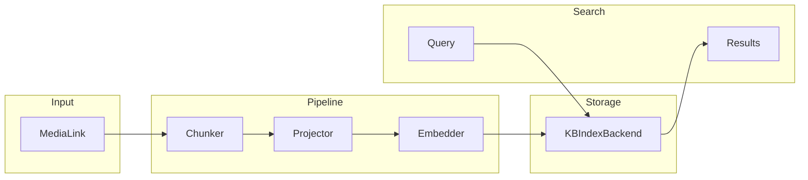

# KnowledgeAgent

The `KnowledgeAgent` indexes media content into a knowledge base and provides semantic search capabilities. It processes `MediaLink` objects through configurable pipelines that chunk, embed, and store content for later retrieval.

## Overview

KnowledgeAgent provides three core capabilities:

- **Catalog**: Register media files in the knowledge base library
- **Index**: Process media through chunking and embedding pipelines, storing vectors for search
- **Search**: Perform hybrid (dense + sparse) semantic search with filtering and reranking

## Architecture



## Configuration

### KnowledgeAgentProps

| Parameter | Type | Default | Description |
|-----------|------|---------|-------------|
| `search_defaults` | `SearchDefaults` | See below | Default search parameters |
| `chunking` | `ChunkingDefaults` | See below | Text chunking settings |
| `embedder` | `EmbedderDefaults` | See below | Embedding settings |

### SearchDefaults

| Parameter | Type | Default | Description |
|-----------|------|---------|-------------|
| `limit` | `int` | `10` | Maximum results to return |
| `hybrid` | `HybridOptions` | 50/50 dense/sparse | Hybrid search weights |
| `rerank` | `RerankOptions` | `None` | Reranking configuration |
| `explain` | `bool` | `False` | Include search explanation |

### ChunkingDefaults

| Parameter | Type | Default | Description |
|-----------|------|---------|-------------|
| `chunk_size` | `int` | `4000` | Maximum chunk size in characters |
| `chunk_overlap` | `int` | `200` | Overlap between chunks |

### EmbedderDefaults

| Parameter | Type | Default | Description |
|-----------|------|---------|-------------|
| `dimension` | `int` | `1024` | Embedding vector dimension |
| `use_sign_hash` | `bool` | `True` | Use sign hashing for sparse vectors |
| `use_tf_log` | `bool` | `True` | Use TF-log weighting |

## Dependencies

KnowledgeAgent requires two guild-level dependencies:

| Dependency | Type | Description |
|------------|------|-------------|
| `filesystem:guild` | `FileSystem` | Filesystem for storing library files |
| `kb_backend:guild` | `KBIndexBackend` | Vector database backend |

### Configuring Dependencies

```yaml
dependency_map:
  filesystem:
    class_name: rustic_ai.core.guild.agent_ext.depends.filesystem.FileSystemResolver
    properties:
      base_path: /path/to/data
    scope: guild
  kb_backend:
    class_name: rustic_ai.chroma.ChromaKBIndexResolver
    properties:
      collection_name: knowledge_base
    scope: guild
```

## Basic Example

```python
from rustic_ai.core.guild.builders import AgentBuilder, GuildBuilder
from rustic_ai.core.guild.dsl import DependencySpec
from rustic_ai.core.agents.indexing.knowledge_agent import (
    KnowledgeAgent,
    KnowledgeAgentProps,
    SearchDefaults,
    ChunkingDefaults,
    EmbedderDefaults,
)

# Configure the agent
props = KnowledgeAgentProps(
    search_defaults=SearchDefaults(limit=20),
    chunking=ChunkingDefaults(chunk_size=2000, chunk_overlap=100),
    embedder=EmbedderDefaults(dimension=1024),
)

# Create agent spec
knowledge_agent_spec = (
    AgentBuilder(KnowledgeAgent)
    .set_id("KnowledgeAgent")
    .set_name("Knowledge Agent")
    .set_description("Indexes and searches documents")
    .set_properties(props)
    .build_spec()
)

# Build guild with dependencies
guild = (
    GuildBuilder("kb_guild", "Knowledge Base Guild", "Document indexing and search")
    .add_agent_spec(knowledge_agent_spec)
    .set_dependency(
        "filesystem",
        DependencySpec(
            class_name="rustic_ai.core.guild.agent_ext.depends.filesystem.FileSystemResolver",
            properties={"base_path": "./data"},
            scope="guild",
        ),
    )
    .set_dependency(
        "kb_backend",
        DependencySpec(
            class_name="rustic_ai.core.knowledgebase.kbindex_backend_memory.MemoryKBIndexBackend",
            properties={},
            scope="guild",
        ),
    )
    .launch("myorg")
)
```

## Message Types

### IndexMediaLinks

Request to index media files into the knowledge base.

```python
from rustic_ai.core.agents.indexing.knowledge_agent import IndexMediaLinks
from rustic_ai.core.agents.commons.media import MediaLink

request = IndexMediaLinks(
    media=[
        MediaLink(
            url="/path/to/document.txt",
            name="document.txt",
            mimetype="text/plain",
            on_filesystem=True,
        ),
        MediaLink(
            url="/path/to/readme.md",
            name="readme.md",
            mimetype="text/markdown",
            on_filesystem=True,
        ),
    ]
)
```

### IndexMediaResults

Response containing indexing status for each media file.

| Field | Type | Description |
|-------|------|-------------|
| `results` | `List[IndexMediaResult]` | Per-file indexing results |

Each `IndexMediaResult` contains:

| Field | Type | Description |
|-------|------|-------------|
| `media_id` | `str` | ID of the media file |
| `knol_id` | `Optional[str]` | Knowledge object ID if successful |
| `status` | `str` | `"indexed"` or `"failed"` |
| `error` | `Optional[str]` | Error message if failed |
| `metadata` | `Optional[Dict]` | Original media metadata |

### CatalogMediaLinks

Request to catalog (register) media files without full indexing.

```python
from rustic_ai.core.agents.indexing.knowledge_agent import CatalogMediaLinks

request = CatalogMediaLinks(
    media=[MediaLink(url="/path/to/file.txt", on_filesystem=True)]
)
```

### KBSearchRequest

Request to search the knowledge base.

```python
from rustic_ai.core.agents.indexing.knowledge_agent import KBSearchRequest, KBTarget
from rustic_ai.core.knowledgebase.query import HybridOptions, BoolFilter, FilterClause, FilterOp

# Simple text search
request = KBSearchRequest(text="machine learning algorithms")

# Advanced search with filters and hybrid options
request = KBSearchRequest(
    text="neural networks",
    limit=20,
    hybrid=HybridOptions(dense_weight=0.7, sparse_weight=0.3),
    filter=BoolFilter(
        must=[FilterClause(field="mimetype", op=FilterOp.EQ, value="text/markdown")]
    ),
    explain=True,
)

# Search specific tables/vectors
request = KBSearchRequest(
    text="embeddings",
    targets=[
        KBTarget(table_name="text_chunks", vector_column="v_text_1024", weight=1.0),
    ],
)
```

### KBSearchResults

Search results with optional explanation data.

| Field | Type | Description |
|-------|------|-------------|
| `results` | `List[SearchResult]` | Matching chunks |
| `query_text` | `Optional[str]` | Original query text |
| `explain` | `Optional[ExplainData]` | Search explanation if requested |
| `search_duration_ms` | `Optional[float]` | Search duration |

Each `SearchResult` contains:

| Field | Type | Description |
|-------|------|-------------|
| `chunk_id` | `str` | Unique chunk identifier |
| `score` | `float` | Similarity score |
| `payload` | `Dict[str, Any]` | Chunk content and metadata |

## Search Features

### Hybrid Search

Combine dense (vector) and sparse (keyword) search:

```python
from rustic_ai.core.knowledgebase.query import HybridOptions, FusionStrategy

hybrid = HybridOptions(
    dense_weight=0.6,      # Weight for vector similarity
    sparse_weight=0.4,     # Weight for keyword matching
    fusion_strategy=FusionStrategy.RRF,  # Reciprocal Rank Fusion
)
```

### Filtering

Apply structured filters to narrow search results:

```python
from rustic_ai.core.knowledgebase.query import BoolFilter, FilterClause, FilterOp

filter = BoolFilter(
    must=[
        FilterClause(field="mimetype", op=FilterOp.EQ, value="text/plain"),
        FilterClause(field="size_in_bytes", op=FilterOp.LT, value=100000),
    ],
    must_not=[
        FilterClause(field="name", op=FilterOp.IN, value=["draft.txt", "temp.txt"]),
    ],
)
```

**Filter Operations:**

| Operation | Description |
|-----------|-------------|
| `EQ` | Equal to |
| `NEQ` | Not equal to |
| `GT` | Greater than |
| `GTE` | Greater than or equal |
| `LT` | Less than |
| `LTE` | Less than or equal |
| `IN` | In list |
| `NIN` | Not in list |
| `EXISTS` | Field exists (boolean) |

### Reranking

Apply reranking to improve result quality:

```python
from rustic_ai.core.knowledgebase.query import RerankOptions, RerankStrategy

rerank = RerankOptions(
    strategy=RerankStrategy.RRF,  # Reciprocal Rank Fusion
    top_n=50,                     # Rerank top N candidates
)
```

**Rerank Strategies:**

| Strategy | Description |
|----------|-------------|
| `NONE` | No reranking |
| `RRF` | Reciprocal Rank Fusion |
| `LINEAR` | Linear score combination |
| `CROSS_ENCODER` | Cross-encoder model (requires model) |
| `LLM` | LLM-based reranking (requires model) |

## Pipeline Components

### Chunkers

Break content into smaller pieces for embedding:

| Chunker | Description |
|---------|-------------|
| `SimpleTextChunker` | Fixed-size character chunks with overlap |
| `RecursiveCharacterChunker` | Recursive splitting on separators |
| `MarkdownHeaderChunker` | Split by markdown headers |
| `SentenceRegexChunker` | Split by sentence boundaries |
| `CodeLanguageChunker` | Language-aware code splitting |
| `JsonPathChunker` | Split JSON by path |

### Embedders

Generate vector representations:

| Embedder | Description |
|----------|-------------|
| `FeatureHashingTextEmbedder` | Fast feature hashing (default) |
| `ByteHistTextEmbedder` | Byte histogram features |
| `ByteNgramTextEmbedder` | Byte n-gram features |
| `ContentDigestEmbedder` | Content hash-based |

### Projectors

Transform content before embedding:

| Projector | Description |
|-----------|-------------|
| `HtmlToTextProjector` | Strip HTML tags |
| `JsonToTextProjector` | Extract text from JSON |
| `TextNormalizeWhitespaceProjector` | Normalize whitespace |

## MediaLink

Input format for media to be indexed:

```python
from rustic_ai.core.agents.commons.media import MediaLink

# Local file
media = MediaLink(
    id="doc-001",
    url="/path/to/document.txt",
    name="document.txt",
    mimetype="text/plain",
    encoding="utf-8",
    on_filesystem=True,
    metadata={"author": "John Doe", "category": "technical"},
)

# Remote URL (will be fetched)
media = MediaLink(
    url="https://example.com/document.pdf",
    name="document.pdf",
    mimetype="application/pdf",
    on_filesystem=False,
)
```

## YAML Configuration

```yaml
agents:
  - id: KnowledgeAgent
    name: Knowledge Agent
    description: Indexes and searches documents
    class_name: rustic_ai.core.agents.indexing.knowledge_agent.KnowledgeAgent
    properties:
      search_defaults:
        limit: 20
        hybrid:
          dense_weight: 0.6
          sparse_weight: 0.4
        explain: false
      chunking:
        chunk_size: 2000
        chunk_overlap: 100
      embedder:
        dimension: 1024
        use_sign_hash: true
        use_tf_log: true

dependency_map:
  filesystem:
    class_name: rustic_ai.core.guild.agent_ext.depends.filesystem.FileSystemResolver
    properties:
      base_path: ./data
    scope: guild
  kb_backend:
    class_name: rustic_ai.chroma.ChromaKBIndexResolver
    properties:
      collection_name: knowledge
    scope: guild
```

## Backend Options

### In-Memory Backend

For development and testing:

```python
from rustic_ai.core.knowledgebase.kbindex_backend_memory import MemoryKBIndexBackend
```

### Chroma Backend

For production with Chroma vector database:

```python
# Requires: poetry add rusticai-chroma
from rustic_ai.chroma import ChromaKBIndexResolver
```

### LanceDB Backend

For production with LanceDB:

```python
# Requires: poetry add rusticai-lancedb
from rustic_ai.lancedb import LanceDBKBIndexBackendResolver
```

## API Reference

### Classes

| Class | Description |
|-------|-------------|
| `KnowledgeAgent` | Main agent for indexing and search |
| `KnowledgeAgentProps` | Agent configuration properties |
| `KnowledgeAgentConfig` | Full configuration with pipelines |
| `IndexMediaLinks` | Request to index media |
| `IndexMediaResults` | Indexing results |
| `CatalogMediaLinks` | Request to catalog media |
| `CatalogMediaResults` | Catalog results |
| `KBSearchRequest` | Search request |
| `KBSearchResults` | Search results |
| `KBTarget` | Search target specification |

### Imports

```python
from rustic_ai.core.agents.indexing.knowledge_agent import (
    KnowledgeAgent,
    KnowledgeAgentProps,
    KnowledgeAgentConfig,
    IndexMediaLinks,
    IndexMediaResults,
    CatalogMediaLinks,
    CatalogMediaResults,
    KBSearchRequest,
    KBSearchResults,
    KBTarget,
    SearchDefaults,
    ChunkingDefaults,
    EmbedderDefaults,
)

from rustic_ai.core.knowledgebase.query import (
    SearchQuery,
    SearchResults,
    SearchResult,
    HybridOptions,
    RerankOptions,
    BoolFilter,
    FilterClause,
    FilterOp,
)

from rustic_ai.core.agents.commons.media import MediaLink
```

## Related Documentation

- [Vector Agent](vector_agent.md) - Simpler vector search agent
- [LLM Agent Memory](../llm_agent_memory.md) - KnowledgeBasedMemoriesStore uses this
- [Dependency Injection](../../howto/dependency_injection.md) - Configuring dependencies
- [Chroma Resolver](../../dependencies/chroma/chroma_resolver.md) - Chroma backend setup
