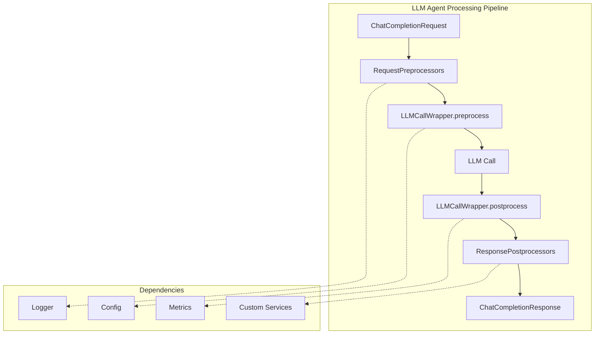

# LLM Agent & Plugin System

The LLM Agent module provides a powerful, extensible framework for integrating Large Language Models into Rustic AI guilds. It features a sophisticated plugin system that allows customization of request preprocessing, LLM call wrapping, and response postprocessing, all with full dependency injection support.

## Overview

The LLM Agent architecture consists of three main components:

1. **LLMAgent** - The core agent that processes chat completion requests
2. **Plugin System** - Extensible plugins for request/response processing
3. **Plugin Dependency Injection** - Allows plugins to access injected dependencies



## Installation

```bash
pip install rusticai-llm-agent rusticai-litellm
```

!!! note
    The `rusticai-llm-agent` package depends on `rusticai-core`.

## Quick Start

Here's a basic example of creating an LLM Agent:

```python
from rustic_ai.core.guild.builders import AgentBuilder, GuildBuilder
from rustic_ai.core.guild.dsl import DependencySpec
from rustic_ai.llm_agent.llm_agent import LLMAgent
from rustic_ai.llm_agent.llm_agent_conf import LLMAgentConfig

# Create the LLM Agent configuration
config = LLMAgentConfig(
    model="gpt-4o",
    default_system_prompt="You are a helpful assistant.",
)

# Build the agent specification
agent_spec = (
    AgentBuilder(LLMAgent)
    .set_id("my-llm-agent")
    .set_name("My LLM Agent")
    .set_description("An LLM Agent for chat completions")
    .set_properties(config.model_dump())
    .build_spec()
)

# Create a guild with LLM dependency
guild = (
    GuildBuilder("demo-guild", "Demo Guild", "A guild with LLM capabilities")
    .add_dependency_resolver(
        "llm",
        DependencySpec(
            class_name="rustic_ai.litellm.dependency.LiteLLMResolver",
            properties={"model": "gpt-4o"}
        )
    )
    .add_agent_spec(agent_spec)
    .launch(organization_id="my-org")
)
```

---

## LLMAgent Configuration

The `LLMAgentConfig` class provides comprehensive configuration options for the LLM Agent.

### Configuration Properties

| Property | Type | Description |
|----------|------|-------------|
| `model` | `str` | The model ID to use (e.g., "gpt-4o", "claude-3-5-sonnet-latest") |
| `base_url` | `Optional[str]` | Custom base URL for the LLM API |
| `api_version` | `Optional[str]` | API version for the LLM |
| `custom_llm_provider` | `Optional[str]` | Custom provider (e.g., "bedrock", "vertex") |
| `timeout` | `Optional[float]` | Request timeout in seconds |
| `max_retries` | `int` | Max retries for failed post-processing (default: 0) |
| `default_system_prompt` | `Optional[str]` | Default system prompt |
| `system_prompt_generator` | `Optional[PromptGenerator]` | Dynamic system prompt generator |
| `request_preprocessors` | `List[RequestPreprocessor]` | Request preprocessor plugins |
| `llm_request_wrappers` | `List[LLMCallWrapper]` | LLM call wrapper plugins |
| `response_postprocessors` | `List[ResponsePostprocessor]` | Response postprocessor plugins |
| `send_response` | `bool` | Whether to send the original LLM response (default: True) |
| `vertex_location` | `Optional[str]` | Vertex AI location |
| `vertex_project` | `Optional[str]` | Google Cloud project ID for Vertex AI |

### Supported Models

The `Models` enum provides common model identifiers:

```python
from rustic_ai.llm_agent.llm_agent_conf import Models

# OpenAI Models
Models.gpt_5
Models.gpt_4o
Models.gpt_4o_mini
Models.o3
Models.o3_mini

# Google Models
Models.gemini_2_5_pro
Models.gemini_2_5_flash
Models.gemini_2_0_flash

# Anthropic Models
Models.claude_opus_4_1
Models.claude_sonnet_4_0
Models.claude_sonnet_3_5
Models.claude_haiku_3_5
```

---

## Plugin System

The LLM Agent plugin system provides three extension points for customizing the request/response lifecycle:

### Plugin Types

| Plugin Type | When Executed | Purpose |
|-------------|---------------|---------|
| `RequestPreprocessor` | Before LLM call | Modify the request before sending |
| `LLMCallWrapper` | Before and after LLM call | Wrap the entire LLM call |
| `ResponsePostprocessor` | After LLM call | Process or act on the response |

### Processing Order

```
1. RequestPreprocessor.preprocess() (in order)
2. LLMCallWrapper.preprocess() (in order)
3. LLM API Call
4. LLMCallWrapper.postprocess() (in reverse order)
5. ResponsePostprocessor.postprocess() (in order)
```

---

## RequestPreprocessor

Request preprocessors modify the `ChatCompletionRequest` before it's sent to the LLM.

### Creating a RequestPreprocessor

```python
from typing import List
from rustic_ai.core.guild.agent import Agent, ProcessContext
from rustic_ai.core.guild.agent_ext.depends.llm.llm import LLM
from rustic_ai.core.guild.agent_ext.depends.llm.models import (
    ChatCompletionRequest,
    SystemMessage,
)
from rustic_ai.llm_agent.plugins.request_preprocessor import RequestPreprocessor


class SystemPromptInjector(RequestPreprocessor):
    """Injects an additional system prompt."""
    
    additional_prompt: str = "Always be concise and helpful."
    
    def preprocess(
        self,
        agent: Agent,
        ctx: ProcessContext[ChatCompletionRequest],
        request: ChatCompletionRequest,
        llm: LLM,
    ) -> ChatCompletionRequest:
        # Add system message at the beginning
        enhanced_messages = [
            SystemMessage(content=self.additional_prompt)
        ] + list(request.messages)
        
        return request.model_copy(update={"messages": enhanced_messages})
```

### Usage

```python
from rustic_ai.llm_agent.llm_agent_conf import LLMAgentConfig

config = LLMAgentConfig(
    model="gpt-4o",
    request_preprocessors=[
        SystemPromptInjector(additional_prompt="Be friendly and professional.")
    ]
)
```

---

## LLMCallWrapper

LLM Call Wrappers provide both pre-processing and post-processing capabilities, ideal for logging, auditing, caching, or metric collection.

### Creating an LLMCallWrapper

```python
from typing import List, Optional
from pydantic import BaseModel
from rustic_ai.core.guild.agent import Agent, ProcessContext
from rustic_ai.core.guild.agent_ext.depends.llm.llm import LLM
from rustic_ai.core.guild.agent_ext.depends.llm.models import (
    ChatCompletionRequest,
    ChatCompletionResponse,
)
from rustic_ai.llm_agent.plugins.llm_call_wrapper import LLMCallWrapper


class AuditingWrapper(LLMCallWrapper):
    """Audits all LLM calls for compliance."""
    
    def preprocess(
        self,
        agent: Agent,
        ctx: ProcessContext[ChatCompletionRequest],
        request: ChatCompletionRequest,
        llm: LLM,
    ) -> ChatCompletionRequest:
        # Log the request (could use self.get_dep() for a logger)
        print(f"[AUDIT] Request to model: {request.model}")
        print(f"[AUDIT] Message count: {len(request.messages)}")
        return request
    
    def postprocess(
        self,
        agent: Agent,
        ctx: ProcessContext[ChatCompletionRequest],
        final_prompt: ChatCompletionRequest,
        llm_response: ChatCompletionResponse,
        llm: LLM,
    ) -> Optional[List[BaseModel]]:
        # Log the response
        if llm_response.choices:
            content = llm_response.choices[0].message.content
            print(f"[AUDIT] Response length: {len(content) if content else 0}")
        
        # Return None to not emit additional messages
        return None
```

### Generating Additional Messages

Wrappers and postprocessors can return messages to be sent:

```python
class SummaryWrapper(LLMCallWrapper):
    """Generates a summary message alongside the response."""
    
    def preprocess(self, agent, ctx, request, llm):
        return request
    
    def postprocess(self, agent, ctx, final_prompt, llm_response, llm):
        # Generate additional output messages
        summary = ResponseSummary(
            model=llm_response.model,
            token_count=llm_response.usage.total_tokens if llm_response.usage else 0
        )
        return [summary]  # This will be sent as an additional message
```

---

## ResponsePostprocessor

Response postprocessors run after the LLM response is received and after wrapper postprocessing.

### Creating a ResponsePostprocessor

```python
from typing import List, Optional
from pydantic import BaseModel
from rustic_ai.core.guild.agent import Agent, ProcessContext
from rustic_ai.core.guild.agent_ext.depends.llm.llm import LLM
from rustic_ai.core.guild.agent_ext.depends.llm.models import (
    ChatCompletionRequest,
    ChatCompletionResponse,
)
from rustic_ai.llm_agent.plugins.response_postprocessor import ResponsePostprocessor


class MetricsCollector(ResponsePostprocessor):
    """Collects metrics from LLM responses."""
    
    def postprocess(
        self,
        agent: Agent,
        ctx: ProcessContext[ChatCompletionRequest],
        final_prompt: ChatCompletionRequest,
        llm_response: ChatCompletionResponse,
        llm: LLM,
    ) -> Optional[List[BaseModel]]:
        # Record metrics
        if llm_response.usage:
            print(f"Tokens used: {llm_response.usage.total_tokens}")
        
        # Optionally return additional messages
        return None
```

---

## Plugin Dependency Injection

Plugins can declare dependencies and access them at runtime via the `get_dep()` method. This enables plugins to use external services like loggers, configuration stores, metrics systems, and more.

### How It Works

1. **Declare Dependencies**: Plugins declare required dependencies in the `depends_on` field
2. **Configure Dependencies**: Dependencies are configured in the guild or agent `dependency_map`
3. **Register for Agent**: List dependencies in `additional_dependencies` on the agent
4. **Access at Runtime**: Use `self.get_dep(agent, "dependency_name")` in plugin methods

### Creating a Plugin with Dependencies

```python
from typing import List, Optional
from pydantic import BaseModel
from rustic_ai.llm_agent.plugins.llm_call_wrapper import LLMCallWrapper


class LoggingWrapper(LLMCallWrapper):
    """A wrapper that uses an injected logger."""
    
    # Declare required dependencies
    depends_on: List[str] = ["logger", "config"]
    
    def preprocess(self, agent, ctx, request, llm):
        # Access dependencies via get_dep(agent, name)
        logger = self.get_dep(agent, "logger")
        config = self.get_dep(agent, "config")
        
        logger.info(f"Processing request with config: {config.name}")
        return request
    
    def postprocess(self, agent, ctx, final_prompt, llm_response, llm):
        logger = self.get_dep(agent, "logger")
        logger.info("LLM call completed successfully")
        return None
```

### Setting Up Dependencies

#### Step 1: Create Dependency Resolvers

```python
from rustic_ai.core.guild.agent_ext.depends.dependency_resolver import DependencyResolver


class Logger:
    """A simple logger service."""
    
    def __init__(self, prefix: str = ""):
        self.prefix = prefix
    
    def info(self, message: str):
        print(f"{self.prefix}[INFO] {message}")
    
    def error(self, message: str):
        print(f"{self.prefix}[ERROR] {message}")


class LoggerResolver(DependencyResolver[Logger]):
    """Resolver for Logger dependency."""
    
    def __init__(self, prefix: str = ""):
        super().__init__()
        self.prefix = prefix
    
    def resolve(self, org_id: str, guild_id: str, agent_id: str = None) -> Logger:
        return Logger(prefix=self.prefix)


class AppConfig:
    """Application configuration."""
    
    def __init__(self, name: str, debug: bool = False):
        self.name = name
        self.debug = debug


class ConfigResolver(DependencyResolver[AppConfig]):
    """Resolver for AppConfig dependency."""
    
    def __init__(self, name: str = "default", debug: bool = False):
        super().__init__()
        self.name = name
        self.debug = debug
    
    def resolve(self, org_id: str, guild_id: str, agent_id: str = None) -> AppConfig:
        return AppConfig(name=self.name, debug=self.debug)
```

#### Step 2: Configure Agent with Dependencies

```python
from rustic_ai.core.guild.builders import AgentBuilder, GuildBuilder
from rustic_ai.core.guild.dsl import DependencySpec
from rustic_ai.llm_agent.llm_agent import LLMAgent
from rustic_ai.llm_agent.llm_agent_conf import LLMAgentConfig

# Create config with plugin that uses dependencies
config = LLMAgentConfig(
    model="gpt-4o",
    llm_request_wrappers=[LoggingWrapper()]
)

# Build agent spec with additional_dependencies
agent_spec = (
    AgentBuilder(LLMAgent)
    .set_id("llm-agent")
    .set_name("LLM Agent with Dependencies")
    .set_description("An LLM agent with plugin dependencies")
    .set_properties(config.model_dump())
    # Register the dependencies the plugins need
    .set_additional_dependencies(["logger", "config"])
    .build_spec()
)

# Build the guild with dependency resolvers
guild = (
    GuildBuilder("demo-guild", "Demo Guild", "Guild with plugin dependencies")
    .set_dependency_map({
        "llm": DependencySpec(
            class_name="rustic_ai.litellm.dependency.LiteLLMResolver",
            properties={"model": "gpt-4o"}
        ),
        "logger": DependencySpec(
            class_name="mypackage.resolvers.LoggerResolver",
            properties={"prefix": "[MyApp] "}
        ),
        "config": DependencySpec(
            class_name="mypackage.resolvers.ConfigResolver",
            properties={"name": "production", "debug": False}
        ),
    })
    .add_agent_spec(agent_spec)
    .launch(organization_id="my-org")
)
```

### Dependency Caching

Dependencies are cached by the resolver for efficiency:

- The resolver's `resolve()` method is called once per unique combination of `org_id`, `guild_id`, and `agent_id`
- Subsequent calls to `get_dep(agent, name)` return the cached instance from the resolver

```python
# Both calls return the same cached instance
logger1 = self.get_dep(agent, "logger")
logger2 = self.get_dep(agent, "logger")
assert logger1 is logger2
```

### Error Handling

The `get_dep()` method provides clear error messages:

```python
# ValueError if dependency not found
plugin.get_dep(agent, "nonexistent")  # ValueError: Dependency 'nonexistent' not found...
```

---

## Complete Example: Audit Trail Plugin

Here's a complete example showing a production-ready audit trail plugin:

```python
"""
audit_plugin.py - Production audit trail for LLM calls
"""
from datetime import datetime
from typing import List, Optional
from pydantic import BaseModel
from rustic_ai.core.guild.agent import Agent, ProcessContext
from rustic_ai.core.guild.agent_ext.depends.llm.llm import LLM
from rustic_ai.core.guild.agent_ext.depends.llm.models import (
    ChatCompletionRequest,
    ChatCompletionResponse,
)
from rustic_ai.llm_agent.plugins.llm_call_wrapper import LLMCallWrapper


class AuditEntry(BaseModel):
    """Audit log entry."""
    timestamp: str
    agent_id: str
    model: str
    request_tokens: int
    response_tokens: int
    latency_ms: float


class AuditTrailWrapper(LLMCallWrapper):
    """
    Comprehensive audit trail wrapper for LLM calls.
    
    Logs all LLM interactions to an audit service for compliance,
    debugging, and cost tracking.
    """
    
    depends_on: List[str] = ["audit_service", "metrics"]
    
    # Track timing per request
    _start_time: Optional[datetime] = None
    
    def preprocess(
        self,
        agent: Agent,
        ctx: ProcessContext[ChatCompletionRequest],
        request: ChatCompletionRequest,
        llm: LLM,
    ) -> ChatCompletionRequest:
        # Record start time
        self._start_time = datetime.utcnow()
        
        # Get audit service and log the request
        audit = self.get_dep(agent, "audit_service")
        audit.log_request(
            agent_id=agent.id,
            model=request.model or "default",
            message_count=len(request.messages),
            timestamp=self._start_time.isoformat()
        )
        
        return request
    
    def postprocess(
        self,
        agent: Agent,
        ctx: ProcessContext[ChatCompletionRequest],
        final_prompt: ChatCompletionRequest,
        llm_response: ChatCompletionResponse,
        llm: LLM,
    ) -> Optional[List[BaseModel]]:
        # Calculate latency
        end_time = datetime.utcnow()
        latency_ms = (end_time - self._start_time).total_seconds() * 1000
        
        # Get dependencies
        audit = self.get_dep(agent, "audit_service")
        metrics = self.get_dep(agent, "metrics")
        
        # Calculate token usage
        usage = llm_response.usage
        request_tokens = usage.prompt_tokens if usage else 0
        response_tokens = usage.completion_tokens if usage else 0
        
        # Log to audit service
        entry = AuditEntry(
            timestamp=end_time.isoformat(),
            agent_id=agent.id,
            model=llm_response.model,
            request_tokens=request_tokens,
            response_tokens=response_tokens,
            latency_ms=latency_ms
        )
        audit.log_completion(entry)
        
        # Record metrics
        metrics.record_latency("llm_call", latency_ms)
        metrics.record_counter("llm_tokens_total", request_tokens + response_tokens)
        
        return None
```

### Usage

```python
from rustic_ai.core.guild.builders import AgentBuilder, GuildBuilder
from rustic_ai.core.guild.dsl import DependencySpec
from rustic_ai.llm_agent.llm_agent import LLMAgent
from rustic_ai.llm_agent.llm_agent_conf import LLMAgentConfig

config = LLMAgentConfig(
    model="gpt-4o",
    llm_request_wrappers=[AuditTrailWrapper()]
)

agent_spec = (
    AgentBuilder(LLMAgent)
    .set_id("audited-llm")
    .set_name("Audited LLM Agent")
    .set_description("LLM Agent with full audit trail")
    .set_properties(config.model_dump())
    .set_additional_dependencies(["audit_service", "metrics"])
    .build_spec()
)

guild = (
    GuildBuilder("production-guild", "Production Guild", "Production environment")
    .set_dependency_map({
        "llm": DependencySpec(
            class_name="rustic_ai.litellm.dependency.LiteLLMResolver",
            properties={"model": "gpt-4o"}
        ),
        "audit_service": DependencySpec(
            class_name="mycompany.audit.AuditServiceResolver",
            properties={"endpoint": "https://audit.internal.company.com"}
        ),
        "metrics": DependencySpec(
            class_name="mycompany.metrics.MetricsResolver",
            properties={"namespace": "llm_agents"}
        ),
    })
    .add_agent_spec(agent_spec)
    .launch(organization_id="production")
)
```

---

## Dynamic System Prompts

The LLM Agent supports dynamic system prompt generation based on incoming messages.

### TemplatedPromptGenerator

```python
from rustic_ai.llm_agent.llm_agent_conf import LLMAgentConfig
from rustic_ai.llm_agent.plugins.prompt_generators import TemplatedPromptGenerator

config = LLMAgentConfig(
    model="gpt-4o",
    system_prompt_generator=TemplatedPromptGenerator(
        update_on_message_format="ContextUpdate",
        template="You are an assistant for {company_name}. The user is {user_name}."
    )
)
```

When a message with format `"ContextUpdate"` is received, the system prompt is updated using the message payload to fill in the template variables.

---

## YAML/JSON Configuration

Plugins can be defined in YAML/JSON configurations using the `kind` field:

```yaml
agents:
  - id: llm-agent
    class_name: rustic_ai.llm_agent.llm_agent.LLMAgent
    properties:
      model: gpt-4o
      request_preprocessors:
        - kind: mypackage.plugins.SystemPromptInjector
          additional_prompt: "Be helpful and concise."
      llm_request_wrappers:
        - kind: mypackage.plugins.AuditTrailWrapper
          depends_on:
            - audit_service
            - metrics
      response_postprocessors:
        - kind: mypackage.plugins.MetricsCollector
    additional_dependencies:
      - audit_service
      - metrics
```

---

## Testing Plugins

Use the testing utilities to test plugins in isolation:

```python
import pytest
from rustic_ai.core.guild.builders import AgentBuilder
from rustic_ai.core.guild.dsl import DependencySpec
from rustic_ai.core.utils.basic_class_utils import get_qualified_class_name
from rustic_ai.llm_agent.llm_agent import LLMAgent
from rustic_ai.llm_agent.llm_agent_conf import LLMAgentConfig
from rustic_ai.testing.helpers import wrap_agent_for_testing


class TestAuditPlugin:
    def test_audit_wrapper_logs_requests(self):
        """Test that the audit wrapper logs requests correctly."""
        
        # Create mock resolvers
        class MockAuditService:
            def __init__(self):
                self.logs = []
            
            def log_request(self, **kwargs):
                self.logs.append(("request", kwargs))
            
            def log_completion(self, entry):
                self.logs.append(("completion", entry))
        
        class MockAuditResolver(DependencyResolver):
            def resolve(self, org_id, guild_id, agent_id=None):
                return MockAuditService()
        
        # Configure agent with plugin
        config = LLMAgentConfig(
            model="mock-model",
            llm_request_wrappers=[AuditTrailWrapper()]
        )
        
        agent_spec = (
            AgentBuilder(LLMAgent)
            .set_id("test-agent")
            .set_name("Test Agent")
            .set_description("Test")
            .set_properties(config.model_dump())
            .set_additional_dependencies(["audit_service", "metrics"])
            .build_spec()
        )
        
        # Set up mock dependencies
        dependency_map = {
            "llm": DependencySpec(
                class_name="tests.mocks.MockLLMResolver"
            ),
            "audit_service": DependencySpec(
                class_name=get_qualified_class_name(MockAuditResolver)
            ),
            "metrics": DependencySpec(
                class_name="tests.mocks.MockMetricsResolver"
            ),
        }
        
        # Create wrapped agent for testing
        agent, results = wrap_agent_for_testing(agent_spec, dependency_map)
        
        # Test the plugin
        plugin = AuditTrailWrapper()
        plugin._set_agent(agent)
        
        audit = plugin.get_dep("audit_service")
        assert isinstance(audit, MockAuditService)
```

---

## Best Practices

### Plugin Design

1. **Keep plugins focused**: Each plugin should have a single responsibility
2. **Use dependencies**: Inject services rather than hardcoding them
3. **Handle errors gracefully**: Don't let plugin errors break the LLM flow
4. **Cache appropriately**: Use `get_dep()` caching for expensive operations

### Dependency Configuration

1. **Define at guild level**: For shared services (logging, metrics, databases)
2. **Define at agent level**: For agent-specific configurations
3. **Use descriptive names**: `audit_service` not `svc1`
4. **Document requirements**: List what dependencies each plugin needs

### Performance

1. **Minimize preprocessing**: Keep request preprocessing lightweight
2. **Async where possible**: Use async operations in postprocessors for I/O
3. **Batch operations**: Combine multiple metric recordings when possible

---

## API Reference

### BasePlugin

```python
class BasePlugin(BaseModel, ABC):
    """Base class for all LLM Agent plugins."""
    
    kind: Optional[str]  # Auto-set to FQCN
    depends_on: List[str] = []  # Declared dependencies
    
    def get_dep(self, agent: Agent, name: str) -> Any:
        """Get a resolved dependency by name."""
```

### RequestPreprocessor

```python
class RequestPreprocessor(BasePlugin):
    @abstractmethod
    def preprocess(
        self,
        agent: Agent,
        ctx: ProcessContext[ChatCompletionRequest],
        request: ChatCompletionRequest,
        llm: LLM,
    ) -> ChatCompletionRequest:
        """Preprocess the request before LLM call."""
```

### LLMCallWrapper

```python
class LLMCallWrapper(BasePlugin):
    @abstractmethod
    def preprocess(
        self,
        agent: Agent,
        ctx: ProcessContext[ChatCompletionRequest],
        request: ChatCompletionRequest,
        llm: LLM,
    ) -> ChatCompletionRequest:
        """Preprocess before LLM call."""
    
    @abstractmethod
    def postprocess(
        self,
        agent: Agent,
        ctx: ProcessContext[ChatCompletionRequest],
        final_prompt: ChatCompletionRequest,
        llm_response: ChatCompletionResponse,
        llm: LLM,
    ) -> Optional[List[BaseModel]]:
        """Postprocess after LLM call."""
```

### ResponsePostprocessor

```python
class ResponsePostprocessor(BasePlugin):
    @abstractmethod
    def postprocess(
        self,
        agent: Agent,
        ctx: ProcessContext[ChatCompletionRequest],
        final_prompt: ChatCompletionRequest,
        llm_response: ChatCompletionResponse,
        llm: LLM,
    ) -> Optional[List[BaseModel]]:
        """Postprocess the LLM response."""
```

---

## Related Documentation

- [Dependency Injection](../howto/dependency_injection.md) - General dependency injection guide
- [Dependencies](../core/dependencies.md) - Core dependency system documentation
- [LiteLLM Agent](litellm/litellm_agent.md) - LiteLLM integration details
- [Creating Your First Agent](../howto/creating_your_first_agent.md) - Agent basics
- [Testing Agents](../howto/testing_agents.md) - Testing guide
