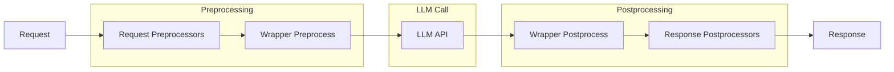

# LLM Agent Plugin System

The LLM Agent plugin system provides a flexible architecture for extending and customizing LLM request/response processing. Plugins can modify requests before they're sent to the LLM, process responses after they're received, and intercept tool calls in the ReAct loop.

## Plugin Architecture Overview



## Plugin Types

### RequestPreprocessor

Modifies the `ChatCompletionRequest` before it's sent to the LLM. Use this for:

- Adding system prompts
- Filtering or transforming messages
- Injecting context or metadata

```python
from rustic_ai.llm_agent.plugins.request_preprocessor import RequestPreprocessor
from rustic_ai.core.guild.agent_ext.depends.llm.models import ChatCompletionRequest


class LoggingPreprocessor(RequestPreprocessor):
    depends_on: List[str] = ["logger"]

    def preprocess(self, agent, ctx, request: ChatCompletionRequest, llm):
        logger = self.get_dep(agent, "logger")
        logger.info(f"Processing request with {len(request.messages)} messages")
        return request
```

### LLMCallWrapper

Wraps the entire LLM call with both preprocessing and postprocessing. Use this for:

- Memory stores (recall before, remember after)
- Auditing and logging
- Caching responses
- Retry logic with modifications

```python
from rustic_ai.llm_agent.plugins.llm_call_wrapper import LLMCallWrapper


class AuditWrapper(LLMCallWrapper):
    depends_on: List[str] = ["audit_log"]

    def preprocess(self, agent, ctx, request, llm):
        self.get_dep(agent, "audit_log").log_request(request)
        return request

    def postprocess(self, agent, ctx, final_prompt, llm_response, llm):
        self.get_dep(agent, "audit_log").log_response(llm_response)
        return None  # No additional messages to send
```

### ResponsePostprocessor

Processes the LLM response after it's received. Use this for:

- Extracting structured data
- Generating additional messages
- Metrics and analytics
- Validation

```python
from rustic_ai.llm_agent.plugins.response_postprocessor import ResponsePostprocessor


class MetricsPostprocessor(ResponsePostprocessor):
    depends_on: List[str] = ["metrics"]

    def postprocess(self, agent, ctx, final_prompt, llm_response, llm):
        metrics = self.get_dep(agent, "metrics")
        metrics.record_tokens(llm_response.usage.total_tokens)
        return None  # No additional messages
```

### ToolCallWrapper (ReActAgent only)

Intercepts tool execution in the ReAct loop. Use this for:

- Caching tool results
- Input/output validation
- Error handling and retries
- Logging tool usage

```python
from rustic_ai.llm_agent.plugins.tool_call_wrapper import (
    ToolCallWrapper,
    ToolSkipResult,
    ToolCallResult,
)


class CachingToolWrapper(ToolCallWrapper):
    cache: dict = {}

    def preprocess(self, agent, ctx, tool_name, tool_input):
        key = f"{tool_name}:{tool_input.model_dump_json()}"
        if key in self.cache:
            return ToolSkipResult(output=self.cache[key])
        return tool_input

    def postprocess(self, agent, ctx, tool_name, tool_input, tool_output):
        key = f"{tool_name}:{tool_input.model_dump_json()}"
        self.cache[key] = tool_output
        return ToolCallResult(output=tool_output)
```

## Plugin Execution Order

### Request Processing (Left to Right)

1. **Request Preprocessors** - Execute in list order
2. **LLM Call Wrapper Preprocess** - Execute in list order

### Response Processing (Special Order)

1. **LLM Call Wrapper Postprocess** - Execute in **reverse** order
2. **Response Postprocessors** - Execute in list order

The reverse order for wrapper postprocessing ensures proper nesting semantics (like try/finally blocks).

## Plugin Configuration

### In Agent Config (Python)

```python
from rustic_ai.llm_agent import LLMAgentConfig
from rustic_ai.llm_agent.memories import QueueBasedMemoriesStore

config = LLMAgentConfig(
    model="gpt-4",
    request_preprocessors=[
        LoggingPreprocessor(depends_on=["logger"])
    ],
    llm_request_wrappers=[
        QueueBasedMemoriesStore(memory_size=50),
        AuditWrapper(depends_on=["audit_log"])
    ],
    response_postprocessors=[
        MetricsPostprocessor(depends_on=["metrics"])
    ]
)
```

### In YAML Specification

```yaml
properties:
  model: gpt-4
  request_preprocessors:
    - kind: mypackage.plugins.LoggingPreprocessor
      depends_on:
        - logger
  llm_request_wrappers:
    - kind: rustic_ai.llm_agent.memories.queue_memories_store.QueueBasedMemoriesStore
      memory_size: 50
    - kind: mypackage.plugins.AuditWrapper
      depends_on:
        - audit_log
  response_postprocessors:
    - kind: mypackage.plugins.MetricsPostprocessor
      depends_on:
        - metrics
```

## Dependency Injection in Plugins

All plugins inherit from `BasePlugin`, which provides dependency injection support.

### Declaring Dependencies

Declare dependencies using the `depends_on` field:

```python
class MyPlugin(LLMCallWrapper):
    depends_on: List[str] = ["logger", "config:guild"]
```

### Resolving Dependencies

Use `self.get_dep(agent, name)` to retrieve resolved dependencies:

```python
def preprocess(self, agent, ctx, request, llm):
    logger = self.get_dep(agent, "logger")
    config = self.get_dep(agent, "config:guild")
    logger.info(f"Using config: {config.name}")
    return request
```

### Dependency Scoping

Dependencies can be scoped at different levels:

| Scope | Syntax | Description |
|-------|--------|-------------|
| Agent | `"name"` | Per-agent instance |
| Guild | `"name:guild"` | Shared across agents in guild |
| Organization | `"name:org"` | Shared across guilds in org |

### Agent Configuration

Dependencies must be:

1. Defined in the guild or agent `dependency_map`
2. Listed in the agent's `additional_dependencies` (for guild/org scoped deps)

```yaml
# Guild-level dependency
dependency_map:
  audit_log:
    class_name: mypackage.resolvers.AuditLogResolver
    properties:
      log_level: INFO
    scope: guild

# Agent spec
agents:
  - id: my_agent
    class_name: rustic_ai.llm_agent.LLMAgent
    additional_dependencies:
      - audit_log:guild
    properties:
      model: gpt-4
      llm_request_wrappers:
        - kind: mypackage.plugins.AuditWrapper
          depends_on:
            - audit_log:guild
```

## Creating Custom Plugins

### Step 1: Choose Base Class

Select the appropriate base class for your use case:

| Base Class | When to Use |
|------------|-------------|
| `RequestPreprocessor` | Modify request only |
| `LLMCallWrapper` | Both pre and post processing |
| `ResponsePostprocessor` | Process response only |
| `ToolCallWrapper` | Intercept tool calls (ReActAgent) |
| `MemoriesStore` | Implement a memory system |

### Step 2: Implement Required Methods

```python
from typing import List, Optional
from pydantic import BaseModel
from rustic_ai.llm_agent.plugins.llm_call_wrapper import LLMCallWrapper


class MyCustomWrapper(LLMCallWrapper):
    # Configuration fields (Pydantic model)
    my_setting: str = "default"
    threshold: int = 100

    # Declare dependencies
    depends_on: List[str] = ["my_service"]

    def preprocess(self, agent, ctx, request, llm):
        """Modify request before LLM call."""
        service = self.get_dep(agent, "my_service")
        # ... modification logic
        return request

    def postprocess(self, agent, ctx, final_prompt, llm_response, llm):
        """Process response after LLM call."""
        # Return None for no messages, or a list of BaseModel payloads
        return None
```

### Step 3: Register in Configuration

```yaml
llm_request_wrappers:
  - kind: mypackage.plugins.MyCustomWrapper
    my_setting: custom_value
    threshold: 200
    depends_on:
      - my_service:guild
```

## Built-in Plugins

### Memory Stores

Memory stores are specialized `LLMCallWrapper` plugins:

| Store | Description |
|-------|-------------|
| `QueueBasedMemoriesStore` | Simple FIFO sliding window |
| `HistoryBasedMemoriesStore` | Extract from message history |
| `StateBackedMemoriesStore` | Persist to agent state |
| `GuildStateBackedMemoriesStore` | Shared guild-level memory |
| `KnowledgeBasedMemoriesStore` | Semantic vector search |

See [LLM Agent Memory Stores](llm_agent_memory.md) for detailed documentation.

### Prompt Generators

For dynamic system prompt generation:

```python
from rustic_ai.llm_agent.plugins.prompt_generators import TemplatedPromptGenerator

generator = TemplatedPromptGenerator(
    template="You are a {role} assistant. Focus on {topic}.",
    update_on_message_format="mypackage.models.ContextUpdate"
)
```

## Plugin Return Values

### Preprocessors

Must return a `ChatCompletionRequest` (modified or unchanged).

### Postprocessors

Return `Optional[List[BaseModel]]`:

- `None` - No additional messages
- `[msg1, msg2]` - Messages to send to the guild

### ToolCallWrapper

**preprocess** returns `Union[BaseModel, ToolSkipResult]`:

- `BaseModel` - Modified tool input, continue execution
- `ToolSkipResult(output="...")` - Skip execution, use provided output

**postprocess** returns `ToolCallResult`:

```python
ToolCallResult(
    output="modified output",
    messages=[AdditionalMessage(...)]  # Optional
)
```

**on_error** returns `Optional[str]`:

- `None` - Use default error handling
- `"fallback output"` - Use as tool output (error handled)
- Raise exception - Propagate error

## Related Documentation

- [LLM Agent & Plugins](llm_agent.md) - Overview of the LLM Agent
- [LLM Agent Memory Stores](llm_agent_memory.md) - Memory store documentation
- [ReAct Agent](react_agent.md) - ReAct Agent with tool calling
- [Dependency Injection](../howto/dependency_injection.md) - Configuring dependencies
