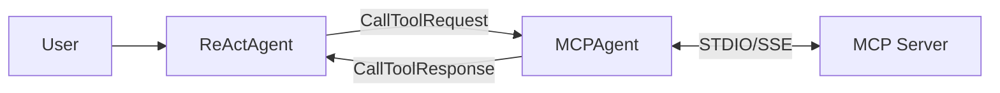

# MCP Integration

The MCP (Model Context Protocol) module enables Rustic AI agents to connect to MCP servers and use their tools. MCP is an open protocol that standardizes how AI applications connect to external data sources and tools.

## Overview

The MCP module provides:

- **MCPAgent**: An agent that connects to a single MCP server and exposes its tools
- **MCPClient**: A client for managing connections to MCP servers
- **Support for STDIO and SSE transports**: Connect to local or remote MCP servers

## Installation

```bash
poetry add rusticai-mcp
```

## What is MCP?

The [Model Context Protocol](https://modelcontextprotocol.io/) is an open standard that enables AI applications to securely connect to external data sources and tools. MCP servers expose capabilities like:

- **Tools**: Functions the AI can call (e.g., file operations, web browsing, database queries)
- **Resources**: Data the AI can read (e.g., files, documents, API responses)
- **Prompts**: Pre-defined prompt templates

Rustic AI's MCP integration allows agents to call tools exposed by any MCP-compatible server.

## MCPAgent

`MCPAgent` connects to a single MCP server and handles tool call requests.

### Configuration

| Parameter | Type | Description |
|-----------|------|-------------|
| `server` | `MCPServerConfig` | MCP server configuration |

### MCPServerConfig

| Parameter | Type | Default | Description |
|-----------|------|---------|-------------|
| `name` | `str` | (required) | Name of the MCP server |
| `type` | `MCPClientType` | `STDIO` | Connection type: `STDIO` or `SSE` |
| `command` | `str` | `None` | Command to execute (STDIO only) |
| `args` | `List[str]` | `[]` | Command arguments (STDIO only) |
| `env` | `Dict[str, str]` | `{}` | Environment variables (STDIO only) |
| `url` | `str` | `None` | Server URL (SSE only) |
| `headers` | `Dict[str, str]` | `{}` | HTTP headers (SSE only) |

### Basic Example

```python
from rustic_ai.core.guild.builders import AgentBuilder, GuildBuilder
from rustic_ai.mcp.agent import MCPAgent
from rustic_ai.mcp.models import MCPAgentConfig, MCPServerConfig, MCPClientType

# Configure the MCP server connection
config = MCPAgentConfig(
    server=MCPServerConfig(
        name="filesystem",
        type=MCPClientType.STDIO,
        command="npx",
        args=["-y", "@modelcontextprotocol/server-filesystem", "/path/to/allowed/directory"]
    )
)

# Create the agent spec
mcp_agent_spec = (
    AgentBuilder(MCPAgent)
    .set_id("FilesystemMCP")
    .set_name("Filesystem MCP Agent")
    .set_description("Provides filesystem access via MCP")
    .set_properties(config)
    .add_additional_topic("mcp_requests")
    .build_spec()
)

# Add to guild
guild = (
    GuildBuilder("mcp_guild", "MCP Demo", "Guild with MCP integration")
    .add_agent_spec(mcp_agent_spec)
    .launch("myorg")
)
```

### YAML Configuration

```yaml
agents:
  - id: FilesystemMCP
    name: Filesystem MCP Agent
    description: Provides filesystem access via MCP
    class_name: rustic_ai.mcp.agent.MCPAgent
    additional_topics:
      - mcp_requests
    properties:
      server:
        name: filesystem
        type: stdio
        command: npx
        args:
          - "-y"
          - "@modelcontextprotocol/server-filesystem"
          - "/path/to/allowed/directory"
```

## Connection Types

### STDIO (Local Processes)

STDIO connections spawn a local process and communicate via standard input/output. This is the most common connection type for local MCP servers.

```python
MCPServerConfig(
    name="playwright",
    type=MCPClientType.STDIO,
    command="npx",
    args=["-y", "@playwright/mcp@latest"],
    env={"DISPLAY": ":0"}  # Optional environment variables
)
```

### SSE (Remote Servers)

SSE (Server-Sent Events) connections communicate with remote MCP servers over HTTP.

```python
MCPServerConfig(
    name="remote-server",
    type=MCPClientType.SSE,
    url="https://mcp.example.com/sse",
    headers={"Authorization": "Bearer token123"}
)
```

## Message Types

### CallToolRequest

Request to call a tool on an MCP server.

| Field | Type | Description |
|-------|------|-------------|
| `server_name` | `str` | Name of the target MCP server |
| `tool_name` | `str` | Name of the tool to call |
| `arguments` | `Dict` | Arguments to pass to the tool |

```python
from rustic_ai.mcp.models import CallToolRequest

request = CallToolRequest(
    server_name="playwright",
    tool_name="browser_navigate",
    arguments={"url": "https://example.com"}
)
```

### CallToolResponse

Response from a tool call.

| Field | Type | Description |
|-------|------|-------------|
| `results` | `List[ToolResult]` | List of results from the tool |
| `is_error` | `bool` | Whether an error occurred |
| `error` | `Optional[str]` | Error message if `is_error` is True |

### ToolResult

Individual result from a tool call.

| Field | Type | Description |
|-------|------|-------------|
| `type` | `Literal["text", "image", "resource"]` | Type of result |
| `content` | `Union[str, Dict]` | Result content |

## Complete Example: Playwright MCP

This example demonstrates using the Playwright MCP server for web automation.

```python
import asyncio
from rustic_ai.core.guild.builders import AgentBuilder, GuildBuilder
from rustic_ai.core.guild.metastore import Metastore
from rustic_ai.core.agents.testutils import ProbeAgent
from rustic_ai.mcp.agent import MCPAgent
from rustic_ai.mcp.models import (
    MCPAgentConfig,
    MCPServerConfig,
    MCPClientType,
    CallToolRequest,
)

# Initialize database
Metastore.initialize_engine("sqlite:///mcp_demo.db")
Metastore.create_db()

# Configure Playwright MCP server
playwright_config = MCPAgentConfig(
    server=MCPServerConfig(
        name="playwright",
        type=MCPClientType.STDIO,
        command="npx",
        args=["-y", "@playwright/mcp@latest"]
    )
)

# Create agent spec
playwright_spec = (
    AgentBuilder(MCPAgent)
    .set_id("PlaywrightAgent")
    .set_name("Playwright MCP Agent")
    .set_description("Web automation via Playwright MCP")
    .set_properties(playwright_config)
    .add_additional_topic("mcp_requests")
    .build_spec()
)

# Build and launch guild
guild = (
    GuildBuilder("playwright_guild", "Playwright Demo", "Web automation demo")
    .add_agent_spec(playwright_spec)
    .bootstrap("sqlite:///mcp_demo.db", "myorg")
)

# Add probe agent for testing
probe_spec = (
    AgentBuilder(ProbeAgent)
    .set_id("probe")
    .set_name("Probe")
    .add_additional_topic("mcp_requests")
    .build_spec()
)
probe = guild._add_local_agent(probe_spec)

# Wait for MCP connection to establish
asyncio.get_event_loop().run_until_complete(asyncio.sleep(3))

# Send a navigation request
navigate_request = CallToolRequest(
    server_name="playwright",
    tool_name="browser_navigate",
    arguments={"url": "https://example.com"}
)

probe.publish_with_guild_route(
    topic="mcp_requests",
    payload=navigate_request
)

# Wait for response
asyncio.get_event_loop().run_until_complete(asyncio.sleep(5))

# Check results
messages = probe.get_messages()
for msg in messages:
    if hasattr(msg.payload, 'results'):
        for result in msg.payload.results:
            print(f"Result ({result.type}): {result.content[:200]}...")
```

## Popular MCP Servers

Here are some commonly used MCP servers:

| Server | Package | Purpose |
|--------|---------|---------|
| Filesystem | `@modelcontextprotocol/server-filesystem` | File operations |
| Playwright | `@playwright/mcp` | Web browsing and automation |
| GitHub | `@modelcontextprotocol/server-github` | GitHub API access |
| Postgres | `@modelcontextprotocol/server-postgres` | PostgreSQL database |
| Brave Search | `@modelcontextprotocol/server-brave-search` | Web search |
| Memory | `@modelcontextprotocol/server-memory` | Persistent memory |

Example configurations:

```python
# Filesystem server
MCPServerConfig(
    name="filesystem",
    type=MCPClientType.STDIO,
    command="npx",
    args=["-y", "@modelcontextprotocol/server-filesystem", "/allowed/path"]
)

# GitHub server
MCPServerConfig(
    name="github",
    type=MCPClientType.STDIO,
    command="npx",
    args=["-y", "@modelcontextprotocol/server-github"],
    env={"GITHUB_TOKEN": "ghp_xxxx"}
)

# Brave Search server
MCPServerConfig(
    name="brave-search",
    type=MCPClientType.STDIO,
    command="npx",
    args=["-y", "@modelcontextprotocol/server-brave-search"],
    env={"BRAVE_API_KEY": "your-api-key"}
)
```

## Using with ReActAgent

MCPAgent can be combined with ReActAgent to create AI agents that can use MCP tools. The typical pattern is:

1. MCPAgent connects to MCP servers and handles `CallToolRequest` messages
2. ReActAgent uses skills/tools that send `CallToolRequest` to the MCP topic
3. Responses flow back to ReActAgent for reasoning



## Error Handling

MCPAgent handles errors gracefully:

- **Unknown Server**: If `server_name` doesn't match, returns `UnsupportedMcpServer` error
- **Connection Failure**: If MCP client can't connect, returns `MCPClientNotFound` error
- **Tool Errors**: If tool execution fails, returns `ErrorProcessingMCPRequest` with details

All errors are sent via `ctx.send_error()` as `ErrorMessage` payloads.

## API Reference

### Classes

| Class | Description |
|-------|-------------|
| `MCPAgent` | Agent that connects to an MCP server |
| `MCPClient` | Client for MCP server communication |
| `MCPAgentConfig` | Configuration for MCPAgent |
| `MCPServerConfig` | MCP server connection settings |
| `CallToolRequest` | Request to call a tool |
| `CallToolResponse` | Response from a tool call |
| `ToolResult` | Individual tool result |
| `MCPClientType` | Enum: `STDIO`, `SSE` |

### Imports

```python
from rustic_ai.mcp.agent import MCPAgent
from rustic_ai.mcp.client import MCPClient
from rustic_ai.mcp.models import (
    MCPAgentConfig,
    MCPServerConfig,
    MCPClientType,
    CallToolRequest,
    CallToolResponse,
    ToolResult,
)
```

## Related Documentation

- [ReAct Agent](../react_agent.md) - Combine with MCP for tool-using AI agents
- [Skills](../../skills/index.md) - Alternative tool system
- [Dependency Injection](../../howto/dependency_injection.md) - Configure agent dependencies
