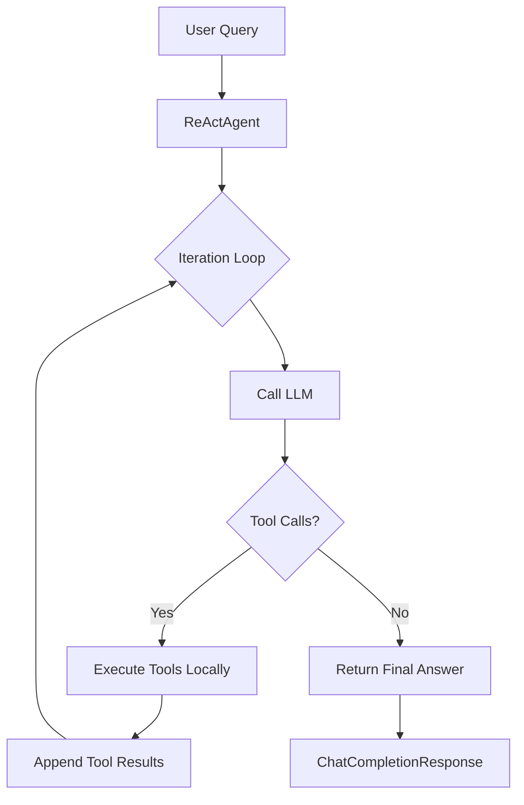

# ReActAgent

## Overview

The `ReActAgent` implements the **ReAct (Reasoning and Acting)** pattern, enabling AI agents to solve complex tasks through an iterative cycle of reasoning, acting (tool use), and observing results.

ReAct is a prompting paradigm that interleaves reasoning traces with actions, allowing LLMs to:
1. **Think** - Reason about the current state and determine next steps
2. **Act** - Invoke tools to gather information or perform actions  
3. **Observe** - Process tool results to inform subsequent reasoning

## Architecture

### Loop-Based Design

The `ReActAgent` uses a loop-based architecture where tool execution happens **synchronously within the agent**:



### Key Components

- **ReActAgent**: Main agent class that runs the ReAct loop
- **ReActAgentConfig**: Configuration including model, toolset, and plugin settings
- **ReActToolset**: Abstract base class defining tool specifications and execution
- **ReActStep**: Model representing a single reasoning step (stored in trace)

## Basic Usage

### Simple ReActAgent

```python
from typing import List

from pydantic import BaseModel, Field
from rustic_ai.core.guild.agent_ext.depends.dependency_resolver import DependencySpec
from rustic_ai.core.guild.agent_ext.depends.llm.models import (
    ChatCompletionRequest,
    ChatCompletionResponse,
    UserMessage,
)
from rustic_ai.core.guild.agent_ext.depends.llm.tools_manager import ToolSpec
from rustic_ai.core.guild.builders import AgentBuilder
from rustic_ai.llm_agent.react import ReActAgent, ReActAgentConfig, ReActToolset
from rustic_ai.testing.helpers import wrap_agent_for_testing


# Define parameter model
class CalculateParams(BaseModel):
    expression: str = Field(description="Mathematical expression to evaluate")


# Define a custom toolset
class CalculatorToolset(ReActToolset):
    def get_toolspecs(self) -> List[ToolSpec]:
        return [
            ToolSpec(
                name="calculate",
                description="Evaluate a mathematical expression",
                parameter_class=CalculateParams
            )
        ]
    
    def execute(self, tool_name: str, args: BaseModel) -> str:
        if tool_name == "calculate":
            return str(eval(args.expression))
        raise ValueError(f"Unknown tool: {tool_name}")


# Build agent spec
agent_spec = (
    AgentBuilder(ReActAgent)
    .set_id("react_agent")
    .set_name("Calculator Agent")
    .set_description("Solves math problems")
    .set_properties(
        ReActAgentConfig(
            model="gpt-4o-mini",
            max_iterations=10,
            toolset=CalculatorToolset(),
        )
    )
    .build_spec()
)

# Test the agent
agent, results = wrap_agent_for_testing(
    agent_spec,
    dependency_map={
        "llm": DependencySpec(
            class_name="rustic_ai.litellm.agent_ext.llm.LiteLLMResolver",
            properties={"model": "gpt-4o-mini"}
        )
    }
)

# Create and send a message (typically done via pytest fixtures)
from rustic_ai.core.messaging.core.message import Message, AgentTag
from rustic_ai.core.guild.dsl import GuildTopics
from rustic_ai.core.utils.gemstone_id import GemstoneGenerator
from rustic_ai.core.utils.basic_class_utils import get_qualified_class_name

generator = GemstoneGenerator(1)
request = ChatCompletionRequest(
    messages=[UserMessage(content="What is 15 * 23?")]
)
message = Message(
    id_obj=generator.get_id(),
    sender=AgentTag(name="test", id="test-1"),
    topics=GuildTopics.DEFAULT_TOPICS,
    payload=request.model_dump(),
    format=get_qualified_class_name(ChatCompletionRequest),
)
agent._on_message(message)

# Get response from results list
assert len(results) == 1
response = ChatCompletionResponse.model_validate(results[0].payload)
print(response.choices[0].message.content)  # "345"
```

### YAML Configuration

You can also define ReActAgent in YAML:

```yaml
id: react_calculator
name: Calculator Agent
description: Solves mathematical problems using tools
class_name: rustic_ai.llm_agent.react.ReActAgent
properties:
  model: gpt-4o-mini
  max_iterations: 10
  toolset:
    kind: my_package.CalculatorToolset
```

## Configuration Options

### ReActAgentConfig

| Property | Type | Default | Description |
|----------|------|---------|-------------|
| `model` | `str \| Models` | Required | LLM model identifier |
| `toolset` | `ReActToolset` | Required | Toolset providing available tools |
| `max_iterations` | `int` | `10` | Maximum reasoning iterations |
| `system_prompt` | `str` | Default ReAct prompt | Custom system prompt |
| `temperature` | `float` | `None` | Sampling temperature (0.0-2.0) |
| `max_tokens` | `int` | `None` | Max tokens per LLM response |
| `base_url` | `str` | `None` | Custom LLM API base URL |
| `timeout` | `float` | `None` | Request timeout in seconds |

### Plugin Configuration

ReActAgent supports multiple plugin types at different execution levels:

#### Loop-Level Plugins
Run once for the entire ReAct loop:

```python
config = ReActAgentConfig(
    model="gpt-4",
    toolset=my_toolset,
    # Runs ONCE before loop starts
    request_preprocessors=[LoggingPreprocessor()],
    # Wraps entire loop (pre once, post once)
    llm_request_wrappers=[CostTrackingWrapper()],
    # Runs ONCE after loop completes
    response_postprocessors=[ValidationPostprocessor()],
)
```

#### Iteration-Level Plugins
Run for each LLM call within the loop:

```python
config = ReActAgentConfig(
    model="gpt-4",
    toolset=my_toolset,
    # Runs BEFORE each LLM call
    iteration_preprocessors=[ContextInjector()],
    # Wraps each individual LLM call
    iteration_wrappers=[PerCallLogger()],
    # Runs AFTER each LLM call
    iteration_postprocessors=[StepEvaluator()],
)
```

#### Tool-Level Plugins
Run for each tool execution:

```python
config = ReActAgentConfig(
    model="gpt-4",
    toolset=my_toolset,
    # Wraps each tool execution
    tool_wrappers=[
        ToolCachingWrapper(),
        ToolValidationWrapper(),
        ToolErrorHandler(),
    ],
)
```

## Creating Custom Toolsets

### Simple Toolset

```python
from typing import List
from pydantic import BaseModel, Field
from rustic_ai.core.guild.agent_ext.depends.llm.tools_manager import ToolSpec
from rustic_ai.llm_agent.react.toolset import ReActToolset

class SearchParams(BaseModel):
    query: str = Field(description="Search query")

class SearchToolset(ReActToolset):
    """Toolset for web search."""
    
    api_key: str = Field(description="API key for search service")
    
    def get_toolspecs(self) -> List[ToolSpec]:
        return [
            ToolSpec(
                name="web_search",
                description="Search the web for information",
                parameter_class=SearchParams
            )
        ]
    
    def execute(self, tool_name: str, args: BaseModel) -> str:
        if tool_name == "web_search":
            # Implement search logic
            return perform_search(args.query, self.api_key)
        raise ValueError(f"Unknown tool: {tool_name}")
```

### Composite Toolset

Combine multiple toolsets:

```python
from rustic_ai.llm_agent.react.toolset import CompositeToolset

composite_toolset = CompositeToolset(
    toolsets=[
        CalculatorToolset(),
        SearchToolset(api_key="..."),
        WeatherToolset(),
    ]
)

config = ReActAgentConfig(
    model="gpt-4",
    toolset=composite_toolset,
)
```

Or in YAML:

```yaml
properties:
  toolset:
    kind: rustic_ai.llm_agent.react.toolset.CompositeToolset
    toolsets:
      - kind: my_package.CalculatorToolset
      - kind: my_package.SearchToolset
        api_key: ${SEARCH_API_KEY}
      - kind: my_package.WeatherToolset
        api_key: ${WEATHER_API_KEY}
```

## Response Format

The `ReActAgent` returns a standard `ChatCompletionResponse` with the reasoning trace embedded:

```python
# After calling agent._on_message(message) and getting response from results:
response = ChatCompletionResponse.model_validate(results[0].payload)

# Access the final answer
answer = response.choices[0].message.content

# Access the ReAct trace from provider_specific_fields
provider_fields = response.choices[0].provider_specific_fields
if provider_fields:
    trace = provider_fields.get("react_trace", [])
    iterations = provider_fields.get("iterations", 0)

    # Each trace step contains:
    for step in trace:
        print(f"Thought: {step['thought']}")
        print(f"Action: {step['action']}")
        print(f"Input: {step['action_input']}")
        print(f"Observation: {step['observation']}")
```

## Advanced Features

### Custom System Prompts

```python
custom_prompt = """You are a financial analyst agent.
Use the provided tools to analyze financial data and provide insights.
Always cite your sources and show your calculations."""

config = ReActAgentConfig(
    model="gpt-4",
    toolset=financial_toolset,
    system_prompt=custom_prompt,
)
```

### Tool Call Wrapping

Implement custom logic around tool execution:

```python
from pydantic import BaseModel
from rustic_ai.llm_agent.plugins.tool_call_wrapper import (
    ToolCallWrapper,
    ToolCallResult,
    ToolSkipResult,
)

class CachingWrapper(ToolCallWrapper):
    """Cache tool results to avoid redundant calls."""
    
    def __init__(self):
        self.cache = {}
    
    def preprocess(
        self, agent, ctx, tool_name: str, tool_input: BaseModel
    ):
        cache_key = f"{tool_name}:{tool_input.model_dump_json()}"
        if cache_key in self.cache:
            # Skip execution, return cached result
            return ToolSkipResult(output=self.cache[cache_key])
        return tool_input
    
    def postprocess(
        self,
        agent,
        ctx,
        tool_name: str,
        tool_input: BaseModel,
        tool_output: str
    ) -> ToolCallResult:
        cache_key = f"{tool_name}:{tool_input.model_dump_json()}"
        self.cache[cache_key] = tool_output
        return ToolCallResult(output=tool_output)

config = ReActAgentConfig(
    model="gpt-4",
    toolset=my_toolset,
    tool_wrappers=[CachingWrapper()],
)
```

### Error Handling

Handle tool errors gracefully:

```python
class ErrorHandlingWrapper(ToolCallWrapper):
    """Provide helpful error messages to the LLM."""
    
    def preprocess(self, agent, ctx, tool_name: str, tool_input: BaseModel):
        return tool_input  # Pass through unchanged
    
    def postprocess(
        self,
        agent,
        ctx,
        tool_name: str,
        tool_input: BaseModel,
        tool_output: str
    ) -> ToolCallResult:
        try:
            # Validate result
            validate_result(tool_output)
            return ToolCallResult(output=tool_output)
        except Exception as e:
            # Return error as observation
            error_msg = f"Tool execution failed: {str(e)}"
            return ToolCallResult(output=error_msg)
```

## Integration with Skills

ReActAgent integrates seamlessly with the Skills module. See [Skills Documentation](../skills/index.md) for details.

Quick example:

```python
from rustic_ai.skills import SkillToolset

# Load skills
toolset = SkillToolset.from_paths([
    Path("/tmp/rustic-skills/pdf"),
    Path("/tmp/rustic-skills/csv"),
])

config = ReActAgentConfig(
    model="gpt-4",
    toolset=toolset,
    system_prompt=toolset.get_combined_system_prompt(),
)
```

## Best Practices

### 1. Set Appropriate Max Iterations

```python
# For simple queries
config = ReActAgentConfig(model="gpt-4", toolset=tools, max_iterations=5)

# For complex multi-step problems
config = ReActAgentConfig(model="gpt-4", toolset=tools, max_iterations=20)
```

### 2. Provide Clear Tool Descriptions

```python
ToolSpec(
    name="fetch_user",
    description=(
        "Fetch user profile by ID. "
        "Returns JSON with name, email, and creation date. "
        "Use when you need user information."
    ),
    parameter_class=FetchUserParams
)
```

### 3. Use Iteration Wrappers for Debugging

```python
from rustic_ai.llm_agent.plugins.llm_call_wrapper import LLMCallWrapper
from rustic_ai.core.guild.agent_ext.depends.llm.models import ChatCompletionRequest

class DebugWrapper(LLMCallWrapper):
    iteration: int = 0
    
    def preprocess(self, agent, ctx, request: ChatCompletionRequest, llm):
        self.iteration += 1
        logger.debug(f"Iteration {self.iteration}: {request.messages[-1]}")
        return request
    
    def postprocess(self, agent, ctx, final_prompt, llm_response, llm):
        logger.debug(f"Response: {llm_response.choices[0].message.content[:100]}...")
        return None  # Return None to not emit additional messages
```

### 4. Handle Tool Timeouts

```python
def execute(self, tool_name: str, args: BaseModel) -> str:
    try:
        result = run_with_timeout(
            lambda: self._execute_tool(tool_name, args),
            timeout=30
        )
        return result
    except TimeoutError:
        return "Tool execution timed out. Please try again."
```

## Comparison: Loop-based vs Message-based

| Aspect | ReActAgent (Loop) | Message-based |
|--------|-------------------|---------------|
| **Latency** | Low (microseconds) | Higher (message hops) |
| **Simplicity** | Simple while loop | Requires routing config |
| **Use Case** | Self-contained tools | Distributed tool agents |
| **Observability** | Custom logging | Built-in message trace |
| **Scalability** | Single process | Independent scaling |

**Choose ReActAgent when:**
- Tools are simple, pure functions
- Latency is critical
- Single-process deployment
- Prototyping or demos

**Choose message-based when:**
- Tools are complex or stateful
- Need distributed execution
- Human-in-the-loop required
- Production observability needed

See [ReAct Agent Design](../design/react-agent-design.md) for detailed architectural comparison.

## Testing

```python
from rustic_ai.testing.helpers import wrap_agent_for_testing
from rustic_ai.core.guild.agent_ext.depends.llm.models import (
    ChatCompletionResponse,
    FinishReason,
)

agent_spec = (
    AgentBuilder(ReActAgent)
    .set_id("test_agent")
    .set_name("Test Agent")
    .set_description("Agent for testing")
    .set_properties(config)
    .build_spec()
)

agent, results = wrap_agent_for_testing(
    agent_spec,
    dependency_map={"llm": llm_dependency}
)

# Send test message (see examples above for message construction)
agent._on_message(test_message)

# Assert on response
assert len(results) == 1
response = ChatCompletionResponse.model_validate(results[0].payload)
assert response.choices[0].finish_reason == FinishReason.stop
assert "expected answer" in response.choices[0].message.content

# Verify trace
trace = response.choices[0].provider_specific_fields["react_trace"]
assert len(trace) == expected_iterations
```

## Reference

### Module: `rustic_ai.llm_agent.react`

**Classes:**
- `ReActAgent` - Main agent implementation
- `ReActAgentConfig` - Configuration model
- `ReActStep` - Reasoning step model
- `ReActToolset` - Abstract toolset base class
- `CompositeToolset` - Combine multiple toolsets

**Constants:**
- `DEFAULT_REACT_SYSTEM_PROMPT` - Default ReAct system prompt

### Related Documentation

- [Skills Integration](../skills/index.md)
- [Creating Custom Agents](../howto/creating_your_first_agent.md)
- [Testing Agents](../howto/testing_agents.md)
- [ReAct Design Document](../design/react-agent-design.md)
- [LLM Agent & Plugins](llm_agent.md)
