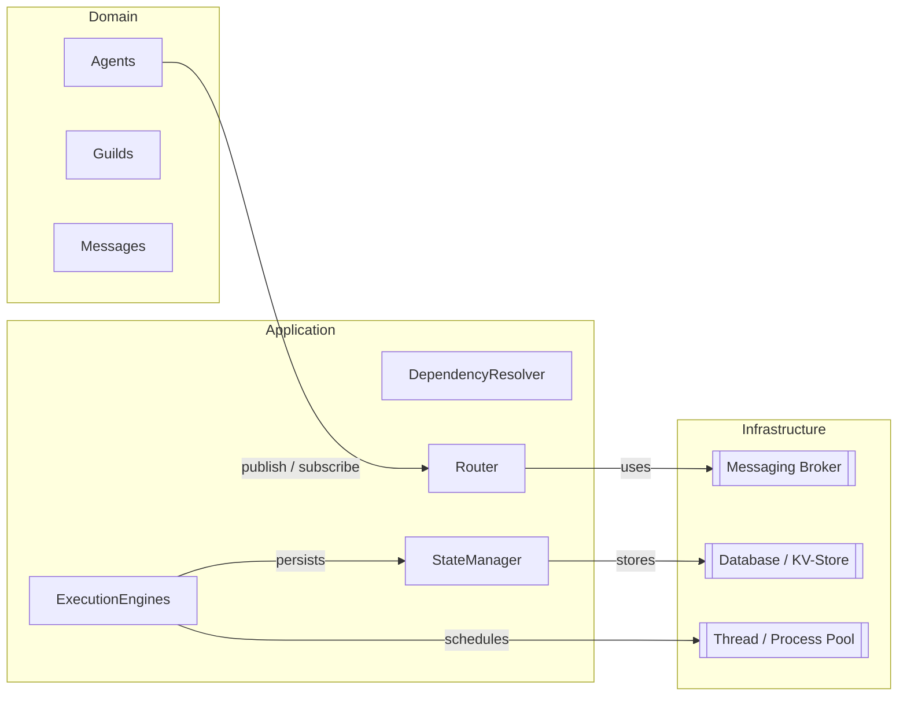
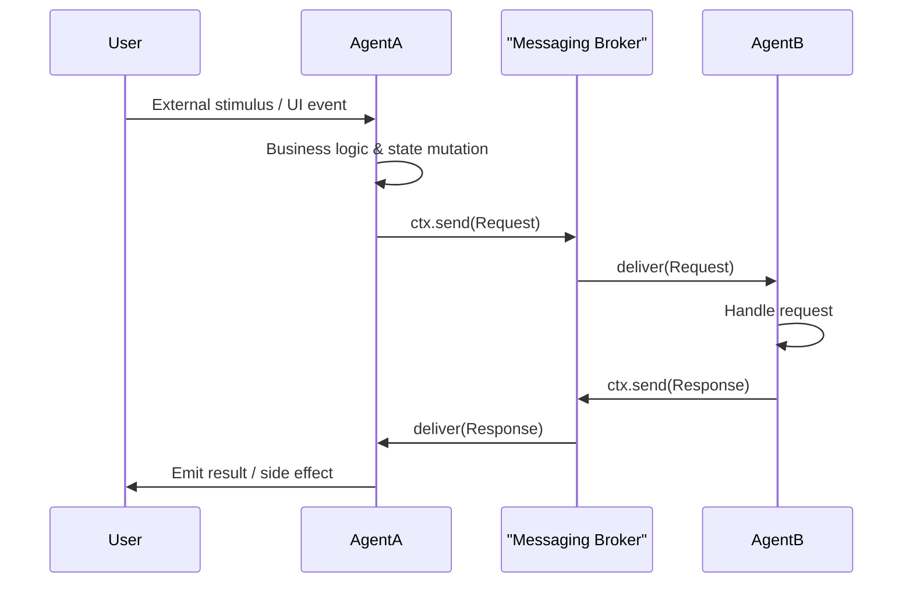

# Architecture Overview

RusticAI Core is engineered to be a **scalable, human-centred, multi-agent platform**. Its design follows a *hexagonal* (ports-and-adapters) philosophy that cleanly separates domain logic from infrastructure, making the system easy to extend, test, and deploy in a variety of environments – from a single-process Jupyter notebook to a distributed cluster.

## Core Layers
1. **Domain Layer** – The pure business logic of agents, guilds, and messages.
2. **Application Layer** – Coordination logic such as execution engines, dependency resolution, and routing.
3. **Infrastructure Layer** – Concrete implementations for messaging brokers, persistence stores, and execution back-ends.

## Component Breakdown
| Component | Responsibility | Extensibility Points |
|-----------|---------------|----------------------|
| **Agent** | Encapsulates autonomous behaviour and state. | Custom handler methods, fixtures, and properties. |
| **Guild** | Logical collection of agents; bootstraps dependencies, execution and routing. | Custom `GuildSpec`, shared dependencies, routing rules. |
| **Messaging** | Topic-based, asynchronous bus that agents use to exchange `Message` objects. | Custom message formats, brokers, routing strategies. |
| **Execution Engine** | Orchestrates when and where each agent runs (sync, multithreaded, distributed). | Implement the `BaseExecutionEngine` interface. |
| **State Manager** | Persists agent/guild state and message history. | Pluggable back-ends (in-memory, SQLite, Redis, etc.). |
| **Dependency Injection** | Lazily resolves resources requested in `dependency_map`. | Custom `DependencyResolver` classes. |

## Data-Flow Walk-Through
Below is a typical *request / response* interaction highlighting how the layers collaborate.

## Execution Models
RusticAI ships with two built-in engines and allows you to plug in your own:

1. **`SyncExecutionEngine`** – Runs everything in a single thread; perfect for tutorials and unit tests.
2. **`MultithreadedExecutionEngine`** – Allocates a thread per agent or a thread-pool; good for IO-bound workloads.
3. **Custom** – Implement `BaseExecutionEngine` to target async runtimes, process pools, or Kubernetes Jobs.

### Choosing an Engine
| Scenario | Recommended Engine |
|----------|--------------------|
| Quick prototyping / notebooks | `SyncExecutionEngine` |
| CPU-light IO-bound ops (API calls, DB) | `MultithreadedExecutionEngine` |
| CPU-heavy or distributed workloads | Custom engine (Ray, Celery, Kubernetes) |

## Error Handling & Observability
- **Structured Errors** – All exceptions propagate through a typed `AgentError` hierarchy allowing rich error routing.
- **Tracing** – Built-in OpenTelemetry hooks emit spans for message processing and dependency resolution.
- **Metrics** – Prometheus counters/latencies for message throughput, handler latency, and error rates.
- **Logging** – JSON structured logs with correlation IDs (guild, agent, message).

## Security Considerations
- **Sandboxing** – Agents running untrusted code can be isolated via OS containers or process sandboxes.
- **Authentication** – Messages carry signed headers (`MessageAuth`) to verify sender identity.
- **Authorization** – Guild-level policies can reject or transform messages based on ACLs.
- **Encryption** – End-to-end optional encryption of payloads at transport or application layer.

## Extending RusticAI Core
1. **New Agent Types** – Subclass `Agent` and register via `AgentBuilder`.
2. **Custom Message Broker** – Implement the `BrokerClient` interface (e.g., Kafka, MQTT, NATS).
3. **Alternative Persistence** – Provide a `StateBackend` driver.
4. **Domain-Specific DSLs** – Use the metaclass hooks to generate agent code from higher-level specs.

> Continue reading the dedicated pages on [Agents](agents.md), [Messaging](messaging.md), [Execution](execution.md), and [State Management](state_management.md) for deep-dives into each component. 