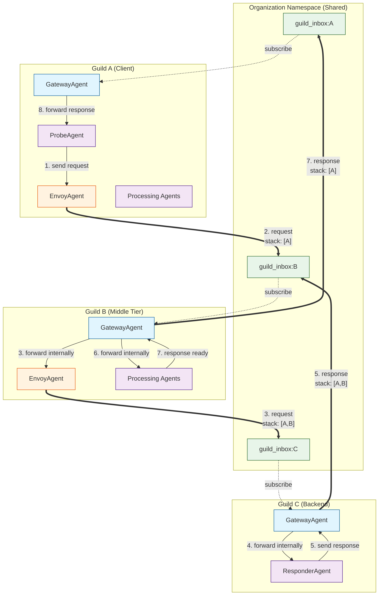
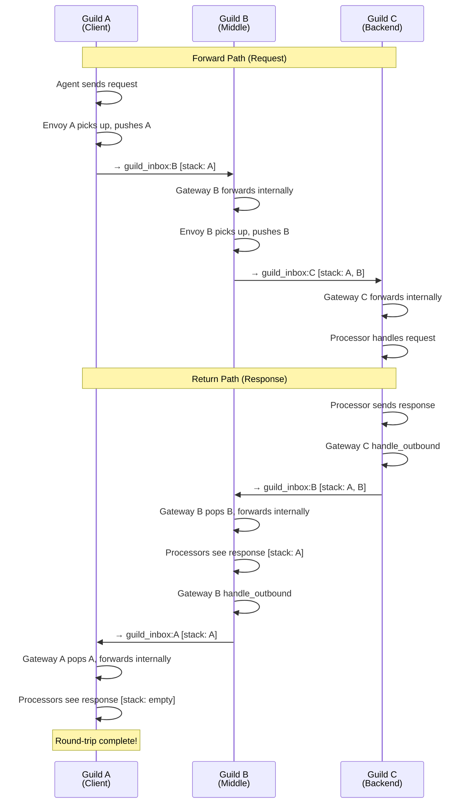
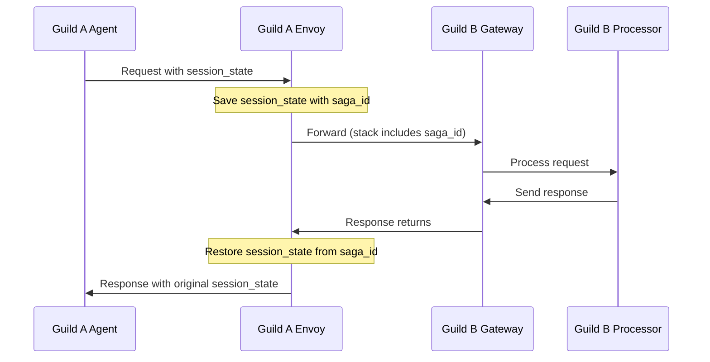

# Guild-to-Guild (G2G) Communication

Guild-to-Guild (G2G) communication enables secure, structured messaging between independent guilds in Rustic AI. This allows you to build microservice-style architectures where specialized guilds can collaborate while maintaining isolation and encapsulation.

## Purpose

- **Service Composition**: Connect specialized guilds (e.g., a "Research Guild" calling a "Database Guild")
- **Isolation**: Maintain guild boundaries while enabling collaboration
- **Multi-Hop Routing**: Support complex workflows spanning multiple guilds (A → B → C → B → A)
- **Security**: Control what message types are allowed across boundaries via format filtering
- **Scalability**: Guilds can be deployed independently and communicate across process/network boundaries

## Architecture Overview

G2G communication uses a **shared namespace** that exists outside individual guild namespaces. Each guild has a unique inbox topic in this shared namespace where other guilds can send messages.



### Message Flow Summary

| Step | Action | Stack State |
|------|--------|-------------|
| 1 | Agent in Guild A sends request | `[]` |
| 2 | Envoy A forwards to B's inbox, pushes A | `[{A, saga_1}]` |
| 3 | Gateway B receives, forwards internally to Envoy B | `[{A, saga_1}]` |
| 4 | Envoy B forwards to C's inbox, pushes B | `[{A, saga_1}, {B, saga_2}]` |
| 5 | Gateway C receives, forwards to Responder | `[{A, saga_1}, {B, saga_2}]` |
| 6 | Responder processes, sends response | `[{A, saga_1}, {B, saga_2}]` |
| 7 | Gateway C forwards response to B's inbox | `[{A, saga_1}, {B, saga_2}]` |
| 8 | Gateway B pops B, restores B's state, then to A | `[{A, saga_1}]` |
| 9 | Gateway A pops A, restores A's state | `[]` |

*Note: `{A, saga_1}` represents `GuildStackEntry(guild_id="A", saga_id="saga_1")`*

### Key Concepts

| Concept | Description |
|---------|-------------|
| **Shared Namespace** | Organization-level namespace where guild inboxes exist |
| **Guild Inbox** | Topic `guild_inbox:{guild_id}` where a guild receives cross-guild messages |
| **Origin Guild Stack** | Stack of `GuildStackEntry` objects tracking the chain of guilds for multi-hop response routing |
| **GuildStackEntry** | Contains `guild_id` for routing and optional `saga_id` for session state preservation |
| **Saga Pattern** | Automatic preservation of `session_state` across G2G boundaries using saga IDs |
| **Boundary Agent** | Base class for agents that communicate across guild boundaries |

## Core Components

### BoundaryAgent

`BoundaryAgent` is the base class for agents that participate in cross-guild communication. It provides:

- Optional subscription to the guild's shared inbox
- Base class for GatewayAgent and EnvoyAgent

```python
from rustic_ai.core.guild.g2g import BoundaryAgent, BoundaryAgentProps

class BoundaryAgentProps(BaseAgentProps):
    """Base properties for boundary agents.
    
    This is a marker base class. Subclasses (GatewayAgentProps, EnvoyAgentProps)
    define their own format filtering properties.
    """
    pass
```

### GatewayAgent

`GatewayAgent` acts as the **server-side** entry point for cross-guild communication. It:

1. Receives requests from external guilds via the shared inbox
2. Forwards requests internally for processing
3. Catches responses and routes them back through the guild chain
4. Handles returned responses from external guilds

```python
from rustic_ai.core.guild.g2g import GatewayAgent, GatewayAgentProps

# Configure a gateway
gateway_spec = (
    AgentBuilder(GatewayAgent)
    .set_id("gateway")
    .set_name("Gateway")
    .set_description("Receives cross-guild requests")
    .set_properties(
        GatewayAgentProps(
            input_formats=["myapp.messages.Request"],      # Accept these formats as requests
            output_formats=["myapp.messages.Response"],    # Forward these formats back
            returned_formats=["myapp.messages.Response"],  # Accept these as returned responses
        )
    )
    .build_spec()
)
```

#### GatewayAgent Message Handlers

| Handler | Trigger | Action |
|---------|---------|--------|
| `handle_inbound_request` | Message from shared inbox, not this guild at stack top | Forward internally for processing |
| `handle_returned_response` | Message from shared inbox, this guild at stack top | Pop stack, forward internally (allows processing), then `handle_outbound` routes it |
| `handle_outbound` | Internal message with origin stack, this guild NOT at top | Forward to previous guild in chain |

### EnvoyAgent

`EnvoyAgent` acts as the **client-side** sender for cross-guild communication. It:

1. Listens for messages on configured topics
2. Forwards matching messages to a target guild's inbox
3. Pushes the current guild onto the `origin_guild_stack` for return routing

`EnvoyAgentProps` has two properties:
- `target_guild` (required): The destination guild ID
- `formats_to_forward` (required): Message formats to forward

```python
from rustic_ai.core.guild.g2g import EnvoyAgent, EnvoyAgentProps

# Configure an envoy to send to another guild
envoy_spec = (
    AgentBuilder(EnvoyAgent)
    .set_id("envoy")
    .set_name("Envoy")
    .set_description("Sends requests to Guild B")
    .set_properties(
        EnvoyAgentProps(
            target_guild="guild-b-id",           # Destination guild (required)
            formats_to_forward=["myapp.messages.Request"], # Required: formats to forward
        )
    )
    .add_additional_topic("outbound")  # Listen on this topic
    .build_spec()
)
```

### BoundaryContext

`BoundaryContext` extends `ProcessContext` with cross-guild messaging capabilities:

```python
class BoundaryContext(ProcessContext):
    """Context for boundary agent processors."""
    
    def forward_out(self, target_guild_id: str, message: Message) -> None:
        """Forward a message to another guild's inbox.
        
        Pushes the current guild onto origin_guild_stack for return routing.
        """
        ...
```

### BoundaryClient

`BoundaryClient` wraps a regular client with shared namespace publishing. It is used internally by `BoundaryContext` and is typically not used directly.

```python
from rustic_ai.core.messaging.core.boundary_client import BoundaryClient

class BoundaryClient:
    """Wrapper around Client that adds shared namespace capabilities."""
    
    def __init__(self, inner_client: Client, organization_id: str):
        ...
    
    def publish_to_guild_inbox(self, target_guild_id: str, message: Message) -> None:
        """Publish a message to a guild's inbox in the shared namespace."""
        ...
```

## Multi-Hop Routing with Origin Guild Stack

The `origin_guild_stack` field on `Message` enables responses to route back through a chain of guilds. This is essential for scenarios like A → B → C → B → A.

### How the Stack Works

Each entry in the stack is a `GuildStackEntry` containing the guild ID and an optional saga ID for session state preservation:

```
Forward Path (Request):
  A sends to B  →  stack becomes [{guild_id: A, saga_id: ...}]
  B sends to C  →  stack becomes [{guild_id: A, saga_id: ...}, {guild_id: B, saga_id: ...}]

Return Path (Response):
  C responds    →  stack is [{guild_id: A, saga_id: ...}, {guild_id: B, saga_id: ...}]
  C's Gateway forwards to B (stack top)
  B's Gateway pops B, restores B's state  →  stack becomes [{guild_id: A, saga_id: ...}]
  B's Gateway forwards to A (stack top)
  A's Gateway pops A, restores A's state  →  stack becomes []
  Round-trip complete with session state preserved!
```

### Stack Operations

| Operation | When | Effect |
|-----------|------|--------|
| **Push** | Envoy forwards OUT | Adds current guild to stack |
| **Pop** | Gateway receives returned response | Removes top (current guild) from stack |
| **Read Top** | Gateway routing decision | Determines next hop or if internal |

### Multi-Hop Flow Diagram



## Message Format Filtering

Gateways and Envoys support format-based filtering to control what types of messages flow across guild boundaries.

### GatewayAgent Formats

```python
GatewayAgentProps(
    input_formats=["myapp.messages.Request", "myapp.messages.Query"],   # Accept as inbound requests
    output_formats=["myapp.messages.Response", "myapp.messages.Result"], # Forward back as responses
    returned_formats=["myapp.messages.Response"],              # Accept as returned responses
)
```

| Property | Purpose | Empty Behavior |
|----------|---------|----------------|
| `input_formats` | Filter incoming requests from external guilds | **Deny all**. Explicit formats recommended. `["*"]` allows all (use with caution). |
| `output_formats` | Filter outgoing responses back to origin | **Deny all**. Explicit formats recommended. `["*"]` allows all (use with caution). |
| `returned_formats` | Filter responses coming back from external guilds | **Deny all**. Explicit formats recommended. `["*"]` allows all (use with caution). |

### EnvoyAgent Formats

```python
EnvoyAgentProps(
    target_guild="guild-b-id",
    formats_to_forward=["myapp.messages.Request"],  # Required. Explicit formats recommended.
)
```

| Property | Purpose | Empty Behavior |
|----------|---------|----------------|
| `formats_to_forward` | Filter messages to forward to target guild | **Validation Error** (Required field). Explicit formats recommended. `["*"]` allows all (use with caution). |

## Security & Access Control

G2G provides security through format filtering and namespace isolation:

### 1. Format Filtering

Restrict message types at boundaries. Empty format lists deny all messages by default:

```python
# Gateway: Control inbound and outbound formats
GatewayAgentProps(
    input_formats=["myapp.messages.Request"],    # Accept these as inbound requests
    output_formats=["myapp.messages.Response"],  # Forward these back as responses
    returned_formats=["myapp.messages.Result"],  # Accept these as returned responses
)

# Envoy: Control what gets forwarded
EnvoyAgentProps(
    target_guild="guild-b-id",
    formats_to_forward=["myapp.messages.Request"],  # Required: explicit formats only
)
```

> **Important**: Empty format lists deny all messages. Always specify explicit formats.

### 2. Organization Namespace Isolation

Cross-guild communication only works within the same organization. The shared namespace is scoped to `organization_id`.

## Complete Example: Two-Guild Communication

### Guild A (Client)

```python
from rustic_ai.core.guild.builders import GuildBuilder, AgentBuilder
from rustic_ai.core.guild.g2g import GatewayAgent, GatewayAgentProps, EnvoyAgent, EnvoyAgentProps

# Build Guild A
guild_a = (
    GuildBuilder(guild_name="client_guild", guild_description="Client")
    .set_messaging("rustic_ai.core.messaging.backend", "InMemoryMessagingBackend", {})
    .bootstrap(database_url, org_id)
)

# Gateway to receive responses
gateway_a = (
    AgentBuilder(GatewayAgent)
    .set_id("gateway_a")
    .set_name("GatewayA")
    .set_properties(GatewayAgentProps(
        returned_formats=["myapp.messages.Response"],
    ))
    .build_spec()
)
guild_a._add_local_agent(gateway_a)

# Envoy to send requests to Guild B
envoy_a = (
    AgentBuilder(EnvoyAgent)
    .set_id("envoy_a")
    .set_name("EnvoyA")
    .set_properties(EnvoyAgentProps(
        target_guild=guild_b.id,
        formats_to_forward=["myapp.messages.Request"],
    ))
    .add_additional_topic("outbound")
    .build_spec()
)
guild_a._add_local_agent(envoy_a)
```

### Guild B (Server)

```python
# Build Guild B
guild_b = (
    GuildBuilder(guild_name="server_guild", guild_description="Server")
    .set_messaging("rustic_ai.core.messaging.backend", "InMemoryMessagingBackend", {})
    .bootstrap(database_url, org_id)
)

# Gateway to receive requests and route responses
gateway_b = (
    AgentBuilder(GatewayAgent)
    .set_id("gateway_b")
    .set_name("GatewayB")
    .set_properties(GatewayAgentProps(
        input_formats=["myapp.messages.Request"],
        output_formats=["myapp.messages.Response"],
    ))
    .build_spec()
)
guild_b._add_local_agent(gateway_b)

# Add your processing agents...
```

### Sending a Request

```python
# From an agent in Guild A, publish to the outbound topic
ctx.send_dict(
    payload={"request_id": "123", "query": "Hello"},
    format="myapp.messages.Request",
    topics="outbound",
)

# Flow:
# 1. Envoy A picks up message on "outbound" topic
# 2. Envoy A forwards to Guild B's inbox (pushes A onto stack)
# 3. Gateway B receives, forwards internally
# 4. Processing agent in B handles request, sends response
# 5. Gateway B's handle_outbound catches response, forwards to A
# 6. Gateway A receives, pops stack, forwards internally
# 7. Original sender receives response
```

## Best Practices

### 1. Use Specific Format Names

Instead of generic formats, use descriptive names that indicate the message purpose:

```python
# Good
formats_to_forward=["research.messages.Query", "research.messages.Result"]

# Avoid
formats_to_forward=["json", "data"]
```

### 2. Configure Both Sides

Ensure both the sending and receiving guilds have compatible configurations:

- Envoy's `formats_to_forward` should match Gateway's `input_formats`
- Gateway's `output_formats` should match what the origin expects in `returned_formats`

### 3. Use Explicit Format Filters

Always configure explicit format filters in production:

```python
# Production gateway
GatewayAgentProps(
    input_formats=["api.v1.Request"],
    output_formats=["api.v1.Response"],
    returned_formats=["api.v1.Result"],
)

# Production envoy
EnvoyAgentProps(
    target_guild="backend-guild-id",
    formats_to_forward=["api.v1.Request"],
)
```

### 4. Handle Errors at Boundaries

Consider adding error handling agents that can catch and transform errors before they cross guild boundaries.

### 5. Monitor Cross-Guild Traffic

The `origin_guild_stack` provides visibility into message routing. Log this for debugging:

```python
@agent.processor(JsonDict)
def handle_message(self, ctx: ProcessContext):
    stack_info = [(e.guild_id, e.saga_id) for e in ctx.message.origin_guild_stack]
    logger.info(f"Message from guild chain: {stack_info}")
```

### 6. Use Session State for Request-Response Correlation

Instead of manual correlation tracking, leverage the automatic saga pattern:

```python
# Good: Use session_state for automatic correlation
ctx.send_dict(
    payload={"query": "search term"},
    format="myapp.messages.Request",
    topics="outbound",
    session_state={"correlation_id": "abc123", "user_context": user_data},
)

# Avoid: Manual correlation tracking
# correlation_store[message_id] = {"correlation_id": "abc123", ...}
```

## Troubleshooting

### Message Not Reaching Target Guild

1. **Check Envoy subscription**: Ensure Envoy is listening on the correct topic
2. **Check format filtering**: Verify `formats_to_forward` includes the message format
3. **Check target guild**: Verify `target_guild` ID is correct

### Response Not Returning

1. **Check Gateway configuration**: Verify `output_formats` includes the response format
2. **Check origin stack**: Ensure the response has `origin_guild_stack` populated
3. **Check returned_formats**: Origin guild's Gateway must accept the response format
4. **Check internal routing**: Ensure the response reaches the Gateway internally

### Multi-Hop Routing Issues

1. **Stack ordering**: Stack should be `[first_guild, second_guild, ...]` (first pushed at index 0)
2. **Intermediate processing**: Each intermediate guild's Gateway must handle `returned_formats`
3. **Stack inspection**: Log `origin_guild_stack` at each hop to trace routing

## Saga Pattern: Session State Preservation

When a message crosses guild boundaries, any `session_state` attached to the message is automatically preserved and restored when the response returns. This enables stateful request-response patterns without manual correlation tracking.

### How It Works

1. **EnvoyAgent** captures the outbound message's `session_state` and saves it with a unique `saga_id`
2. The `saga_id` is stored in the `origin_guild_stack` alongside the guild ID
3. **GatewayAgent** restores the saved `session_state` when the response returns



### GuildStackEntry Structure

The `origin_guild_stack` uses `GuildStackEntry` objects instead of plain strings:

```python
from rustic_ai.core.messaging import GuildStackEntry

# Each entry in the stack contains:
GuildStackEntry(
    guild_id="source-guild-id",  # The guild ID for routing
    saga_id="unique-saga-id",    # Optional: ID for session state lookup
)
```

### Usage Example

Session state is automatically preserved when you include it in your outbound message:

```python
@agent.processor(QueryRequest)
def initiate_query(self, ctx: ProcessContext, request: QueryRequest):
    # Save context that should be preserved across the G2G call
    ctx.send_dict(
        payload={"query": request.query},
        format="myapp.messages.Request",
        topics="outbound",
        session_state={
            "user_id": request.user_id,
            "correlation_id": request.correlation_id,
            "step": "awaiting_response",
            "timestamp": time.time(),
        }
    )

@agent.processor(QueryResponse)
def handle_response(self, ctx: ProcessContext, response: QueryResponse):
    # session_state is automatically restored!
    state = ctx.message.session_state
    user_id = state.get("user_id")
    correlation_id = state.get("correlation_id")
    
    # Continue processing with original context
    logger.info(f"Response for user {user_id}, correlation {correlation_id}")
```

### Key Points

| Aspect | Behavior |
|--------|----------|
| **Automatic** | No explicit correlation tracking needed |
| **Non-empty Only** | State is only saved if `session_state` is not empty |
| **Restored on Return** | State is restored when response crosses back into origin guild |
| **Multi-hop Support** | Each hop in the chain preserves its own session state |
| **Cleanup** | Saga state is deleted after restoration (one-time use) |

### Multi-Hop Saga State

In multi-hop scenarios (A → B → C → B → A), each guild's session state is independently preserved:

```
Request A → B:
  - A's Envoy saves A's session_state with saga_id_1
  - Stack: [{guild_id: A, saga_id: saga_id_1}]

Request B → C:
  - B's Envoy saves B's session_state with saga_id_2
  - Stack: [{guild_id: A, saga_id: saga_id_1}, {guild_id: B, saga_id: saga_id_2}]

Response C → B:
  - B's Gateway restores B's session_state from saga_id_2
  - Stack: [{guild_id: A, saga_id: saga_id_1}]

Response B → A:
  - A's Gateway restores A's session_state from saga_id_1
  - Stack: []
```

### Low-Level API

Saga state is managed through the guild's state system using `StateRefresherMixin`. The key helper function is available:

```python
from rustic_ai.core.guild.g2g import SAGA_STATE_PREFIX, get_saga_state_key
from rustic_ai.core.state.models import StateUpdateFormat

# Generate the state key for a saga
saga_id = "custom-saga-id"
state_key = get_saga_state_key(saga_id)  # Returns "g2g_saga.custom-saga-id"

# Save saga state (using StateRefresherMixin via agent)
self.update_guild_state(
    ctx,
    update_format=StateUpdateFormat.JSON_MERGE_PATCH,
    update={state_key: {"custom": "data"}},
)

# Retrieve saga state from agent's cached guild state
state = self._guild_state.get(state_key)

# Delete saga state (set to None via merge patch)
self.update_guild_state(
    ctx,
    update_format=StateUpdateFormat.JSON_MERGE_PATCH,
    update={state_key: None},
)
```

## API Reference

### Classes

- `BoundaryAgent` - Base class for boundary agents
- `BoundaryAgentProps` - Marker base class for boundary agent properties
- `GatewayAgent` - Server-side gateway
- `GatewayAgentProps` - Gateway properties (includes `input_formats`, `output_formats`, `returned_formats`)
- `EnvoyAgent` - Client-side envoy
- `EnvoyAgentProps` - Envoy properties (includes `target_guild`, `formats_to_forward`)
- `BoundaryContext` - Cross-guild context with `forward_out()` method
- `BoundaryClient` (from `rustic_ai.core.messaging.core.boundary_client`) - Shared namespace client
- `GuildStackEntry` - Stack entry with `guild_id` and optional `saga_id`

### Exported from `rustic_ai.core.guild.g2g`

```python
from rustic_ai.core.guild.g2g import (
    BoundaryAgent,
    BoundaryAgentProps,
    BoundaryContext,
    EnvoyAgent,
    EnvoyAgentProps,
    GatewayAgent,
    GatewayAgentProps,
    GuildStackEntry,
    SAGA_STATE_PREFIX,
    get_saga_state_key,
)
```

### Message Fields

- `origin_guild_stack: List[GuildStackEntry]` - Stack tracking guild chain for response routing, with optional saga IDs for session state preservation

## See Also

- [Guilds](guilds.md) - Guild fundamentals
- [Messaging](messaging.md) - Messaging system details
- [How-To: Cross-Guild Communication](../howto/cross_guild_communication.md) - Step-by-step tutorial
