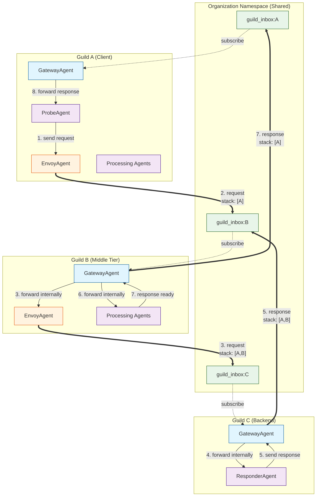
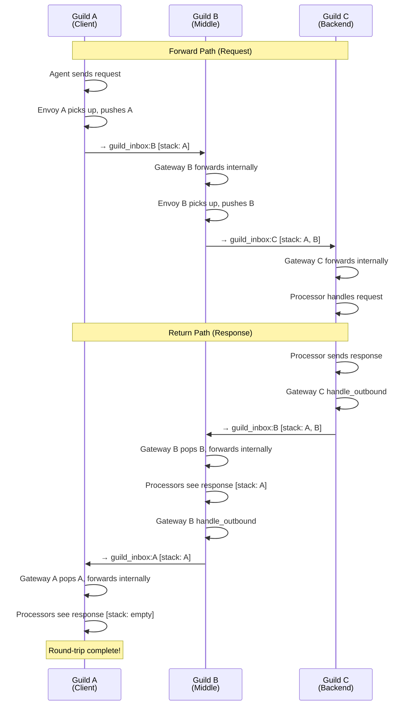

# Guild-to-Guild (G2G) Communication

Guild-to-Guild (G2G) communication enables secure, structured messaging between independent guilds in Rustic AI. This allows you to build microservice-style architectures where specialized guilds can collaborate while maintaining isolation and encapsulation.

## Purpose

- **Service Composition**: Connect specialized guilds (e.g., a "Research Guild" calling a "Database Guild")
- **Isolation**: Maintain guild boundaries while enabling collaboration
- **Multi-Hop Routing**: Support complex workflows spanning multiple guilds (A → B → C → B → A)
- **Security**: Control which guilds can communicate and what message types are allowed
- **Scalability**: Guilds can be deployed independently and communicate across process/network boundaries

## Architecture Overview

G2G communication uses a **shared namespace** that exists outside individual guild namespaces. Each guild has a unique inbox topic in this shared namespace where other guilds can send messages.



### Message Flow Summary

| Step | Action | Stack State |
|------|--------|-------------|
| 1 | Agent in Guild A sends request | `[]` |
| 2 | Envoy A forwards to B's inbox, pushes A | `[A]` |
| 3 | Gateway B receives, forwards internally to Envoy B | `[A]` |
| 4 | Envoy B forwards to C's inbox, pushes B | `[A, B]` |
| 5 | Gateway C receives, forwards to Responder | `[A, B]` |
| 6 | Responder processes, sends response | `[A, B]` |
| 7 | Gateway C forwards response to B's inbox | `[A, B]` |
| 8 | Gateway B pops B, forwards internally, then to A | `[A]` |
| 9 | Gateway A pops A, forwards internally | `[]` |

### Key Concepts

| Concept | Description |
|---------|-------------|
| **Shared Namespace** | Organization-level namespace where guild inboxes exist |
| **Guild Inbox** | Topic `guild_inbox:{guild_id}` where a guild receives cross-guild messages |
| **Origin Guild Stack** | Tracks the chain of guilds for multi-hop response routing |
| **Boundary Agent** | Base class for agents that communicate across guild boundaries |

## Core Components

### BoundaryAgent

`BoundaryAgent` is the base class for agents that participate in cross-guild communication. It provides:

- Access control via `allowed_source_guilds` and `allowed_target_guilds`
- Optional subscription to the guild's shared inbox
- Methods to check if source/target guilds are allowed

```python
from rustic_ai.core.guild.g2g import BoundaryAgent, BoundaryAgentProps

class BoundaryAgentProps(BaseAgentProps):
    """Base properties for boundary agents."""
    
    allowed_source_guilds: List[str] = []  # Empty = allow all
    allowed_target_guilds: List[str] = []  # Empty = allow all
```

### GatewayAgent

`GatewayAgent` acts as the **server-side** entry point for cross-guild communication. It:

1. Receives requests from external guilds via the shared inbox
2. Forwards requests internally for processing
3. Catches responses and routes them back through the guild chain
4. Handles returned responses from external guilds

```python
from rustic_ai.core.guild.g2g import GatewayAgent, GatewayAgentProps

# Configure a gateway
gateway_spec = (
    AgentBuilder(GatewayAgent)
    .set_id("gateway")
    .set_name("Gateway")
    .set_description("Receives cross-guild requests")
    .set_properties(
        GatewayAgentProps(
            input_formats=["request/json"],      # Accept these formats as requests
            output_formats=["response/json"],    # Forward these formats back
            returned_formats=["response/json"],  # Accept these as returned responses
            allowed_source_guilds=["guild-a"],   # Only accept from these guilds
        )
    )
    .build_spec()
)
```

#### GatewayAgent Message Handlers

| Handler | Trigger | Action |
|---------|---------|--------|
| `handle_inbound_request` | Message from shared inbox, not this guild at stack top | Forward internally for processing |
| `handle_returned_response` | Message from shared inbox, this guild at stack top | Pop stack, forward internally (allows processing), then `handle_outbound` routes it |
| `handle_outbound` | Internal message with origin stack, this guild NOT at top | Forward to previous guild in chain |

### EnvoyAgent

`EnvoyAgent` acts as the **client-side** sender for cross-guild communication. It:

1. Listens for messages on configured topics
2. Forwards matching messages to a target guild's inbox
3. Pushes the current guild onto the `origin_guild_stack` for return routing

```python
from rustic_ai.core.guild.g2g import EnvoyAgent, EnvoyAgentProps

# Configure an envoy to send to another guild
envoy_spec = (
    AgentBuilder(EnvoyAgent)
    .set_id("envoy")
    .set_name("Envoy")
    .set_description("Sends requests to Guild B")
    .set_properties(
        EnvoyAgentProps(
            target_guild="guild-b-id",           # Destination guild
            formats_to_forward=["request/json"], # Only forward these formats
            allowed_target_guilds=["guild-b-id"],# Security filter
        )
    )
    .add_additional_topic("outbound")  # Listen on this topic
    .build_spec()
)
```

### BoundaryContext

`BoundaryContext` extends `ProcessContext` with cross-guild messaging capabilities:

```python
class BoundaryContext(ProcessContext):
    """Context for boundary agent processors."""
    
    def forward_out(self, target_guild_id: str, message: Message) -> None:
        """Forward a message to another guild's inbox.
        
        Pushes the current guild onto origin_guild_stack for return routing.
        """
        ...
```

### BoundaryClient

`BoundaryClient` wraps a regular client with shared namespace publishing:

```python
class BoundaryClient:
    """Client for publishing to the shared organization namespace."""
    
    def publish_to_guild_inbox(self, target_guild_id: str, message: Message) -> None:
        """Publish a message to a guild's inbox in the shared namespace."""
        topic = f"guild_inbox:{target_guild_id}"
        # Publishes to shared namespace, not guild namespace
        ...
```

## Multi-Hop Routing with Origin Guild Stack

The `origin_guild_stack` field on `Message` enables responses to route back through a chain of guilds. This is essential for scenarios like A → B → C → B → A.

### How the Stack Works

```
Forward Path (Request):
  A sends to B  →  stack becomes ["A"]
  B sends to C  →  stack becomes ["A", "B"]

Return Path (Response):
  C responds    →  stack is ["A", "B"]
  C's Gateway forwards to B (stack top)
  B's Gateway pops B, forwards internally  →  stack becomes ["A"]
  B's Gateway forwards to A (stack top)
  A's Gateway pops A, forwards internally  →  stack becomes []
  Round-trip complete!
```

### Stack Operations

| Operation | When | Effect |
|-----------|------|--------|
| **Push** | Envoy forwards OUT | Adds current guild to stack |
| **Pop** | Gateway receives returned response | Removes top (current guild) from stack |
| **Read Top** | Gateway routing decision | Determines next hop or if internal |

### Multi-Hop Flow Diagram



## Message Format Filtering

Gateways and Envoys support format-based filtering to control what types of messages flow across guild boundaries.

### GatewayAgent Formats

```python
GatewayAgentProps(
    input_formats=["request/json", "query/json"],   # Accept as inbound requests
    output_formats=["response/json", "result/json"], # Forward back as responses
    returned_formats=["response/json"],              # Accept as returned responses
)
```

| Property | Purpose | Empty Behavior |
|----------|---------|----------------|
| `input_formats` | Filter incoming requests from external guilds | Accept all formats |
| `output_formats` | Filter outgoing responses back to origin | Forward all formats |
| `returned_formats` | Filter responses coming back from external guilds | Accept all formats |

### EnvoyAgent Formats

```python
EnvoyAgentProps(
    target_guild="guild-b-id",
    formats_to_forward=["request/json"],  # Only forward these formats
)
```

## Security & Access Control

G2G provides multiple layers of security:

### 1. Source Guild Filtering (Gateway)

Control which guilds can send requests to this guild:

```python
GatewayAgentProps(
    allowed_source_guilds=["trusted-guild-1", "trusted-guild-2"],
    # Empty list = accept from all guilds
)
```

### 2. Target Guild Filtering (Envoy)

Control which guilds this envoy can send to:

```python
EnvoyAgentProps(
    target_guild="guild-b-id",
    allowed_target_guilds=["guild-b-id", "guild-c-id"],
    # Empty list = allow all targets
)
```

### 3. Format Filtering

Restrict message types at boundaries (see above).

### 4. Organization Namespace Isolation

Cross-guild communication only works within the same organization. The shared namespace is scoped to `organization_id`.

## Complete Example: Two-Guild Communication

### Guild A (Client)

```python
from rustic_ai.core.guild.builders import GuildBuilder, AgentBuilder
from rustic_ai.core.guild.g2g import GatewayAgent, GatewayAgentProps, EnvoyAgent, EnvoyAgentProps

# Build Guild A
guild_a = (
    GuildBuilder(guild_name="client_guild", guild_description="Client")
    .set_messaging("rustic_ai.core.messaging.backend", "InMemoryMessagingBackend", {})
    .bootstrap(database_url, org_id)
)

# Gateway to receive responses
gateway_a = (
    AgentBuilder(GatewayAgent)
    .set_id("gateway_a")
    .set_name("GatewayA")
    .set_properties(GatewayAgentProps(
        returned_formats=["response/json"],
    ))
    .build_spec()
)
guild_a._add_local_agent(gateway_a)

# Envoy to send requests to Guild B
envoy_a = (
    AgentBuilder(EnvoyAgent)
    .set_id("envoy_a")
    .set_name("EnvoyA")
    .set_properties(EnvoyAgentProps(
        target_guild=guild_b.id,
        formats_to_forward=["request/json"],
    ))
    .add_additional_topic("outbound")
    .build_spec()
)
guild_a._add_local_agent(envoy_a)
```

### Guild B (Server)

```python
# Build Guild B
guild_b = (
    GuildBuilder(guild_name="server_guild", guild_description="Server")
    .set_messaging("rustic_ai.core.messaging.backend", "InMemoryMessagingBackend", {})
    .bootstrap(database_url, org_id)
)

# Gateway to receive requests and route responses
gateway_b = (
    AgentBuilder(GatewayAgent)
    .set_id("gateway_b")
    .set_name("GatewayB")
    .set_properties(GatewayAgentProps(
        input_formats=["request/json"],
        output_formats=["response/json"],
    ))
    .build_spec()
)
guild_b._add_local_agent(gateway_b)

# Add your processing agents...
```

### Sending a Request

```python
# From an agent in Guild A, publish to the outbound topic
ctx.send_dict(
    payload={"request_id": "123", "query": "Hello"},
    format="request/json",
    topics="outbound",
)

# Flow:
# 1. Envoy A picks up message on "outbound" topic
# 2. Envoy A forwards to Guild B's inbox (pushes A onto stack)
# 3. Gateway B receives, forwards internally
# 4. Processing agent in B handles request, sends response
# 5. Gateway B's handle_outbound catches response, forwards to A
# 6. Gateway A receives, pops stack, forwards internally
# 7. Original sender receives response
```

## Best Practices

### 1. Use Specific Format Names

Instead of generic formats, use descriptive names that indicate the message purpose:

```python
# Good
formats_to_forward=["research/query", "research/result"]

# Avoid
formats_to_forward=["json", "data"]
```

### 2. Configure Both Sides

Ensure both the sending and receiving guilds have compatible configurations:

- Envoy's `formats_to_forward` should match Gateway's `input_formats`
- Gateway's `output_formats` should match what the origin expects in `returned_formats`

### 3. Use Security Filters in Production

Always configure `allowed_source_guilds` and `allowed_target_guilds` in production:

```python
# Production gateway
GatewayAgentProps(
    allowed_source_guilds=["known-client-guild-1", "known-client-guild-2"],
    input_formats=["api/request"],
)
```

### 4. Handle Errors at Boundaries

Consider adding error handling agents that can catch and transform errors before they cross guild boundaries.

### 5. Monitor Cross-Guild Traffic

The `origin_guild_stack` provides visibility into message routing. Log this for debugging:

```python
@agent.processor(JsonDict)
def handle_message(self, ctx: ProcessContext):
    logger.info(f"Message from guild chain: {ctx.message.origin_guild_stack}")
```

## Troubleshooting

### Message Not Reaching Target Guild

1. **Check Envoy subscription**: Ensure Envoy is listening on the correct topic
2. **Check format filtering**: Verify `formats_to_forward` includes the message format
3. **Check target guild**: Verify `target_guild` ID is correct
4. **Check security filters**: Ensure `allowed_target_guilds` allows the target

### Response Not Returning

1. **Check Gateway configuration**: Verify `output_formats` includes the response format
2. **Check origin stack**: Ensure the response has `origin_guild_stack` populated
3. **Check returned_formats**: Origin guild's Gateway must accept the response format
4. **Check internal routing**: Ensure the response reaches the Gateway internally

### Multi-Hop Routing Issues

1. **Stack ordering**: Stack should be `[first_guild, second_guild, ...]` (first pushed at index 0)
2. **Intermediate processing**: Each intermediate guild's Gateway must handle `returned_formats`
3. **Stack inspection**: Log `origin_guild_stack` at each hop to trace routing

## API Reference

### Classes

- [`BoundaryAgent`](../api/g2g/boundary_agent.md) - Base class for boundary agents
- [`BoundaryAgentProps`](../api/g2g/boundary_agent.md#boundaryagentprops) - Base properties
- [`GatewayAgent`](../api/g2g/gateway_agent.md) - Server-side gateway
- [`GatewayAgentProps`](../api/g2g/gateway_agent.md#gatewayagentprops) - Gateway properties
- [`EnvoyAgent`](../api/g2g/envoy_agent.md) - Client-side envoy
- [`EnvoyAgentProps`](../api/g2g/envoy_agent.md#envoyagentprops) - Envoy properties
- [`BoundaryContext`](../api/g2g/boundary_context.md) - Cross-guild context
- [`BoundaryClient`](../api/g2g/boundary_client.md) - Shared namespace client

### Message Fields

- `origin_guild_stack: List[str]` - Stack tracking guild chain for response routing

## See Also

- [Guilds](guilds.md) - Guild fundamentals
- [Messaging](messaging.md) - Messaging system details
- [How-To: Cross-Guild Communication](../howto/cross_guild_communication.md) - Step-by-step tutorial
