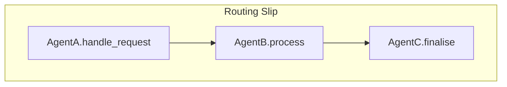

# Messaging

The messaging system in RusticAI enables asynchronous, topic-based communication between agents and guilds. It is designed for scalability, flexibility, and extensibility.

## Purpose
- Facilitate communication between agents, guilds, and external systems
- Support topic-based publish/subscribe messaging
- Enable routing, filtering, and transformation of messages

## Key Concepts
- **Topics**: Channels for message delivery. Agents and guilds subscribe to topics to receive relevant messages.
- **Messages**: Structured data packets exchanged between agents. Support for custom formats and priorities.
- **Routing Slip**: An ordered list of routing rules that define a multi-step processing pipeline.
- **Delivery Semantics**: At-least-once by default, with configurable exactly-once support when the broker provides deduplication.
- **Clients**: Agents interact with the messaging system via client interfaces.

### Message Schema
Every `Message` instance serialises to the following canonical JSON structure:

```jsonc
{
  "id": "8e25e068-...",
  "sender": "agent-1",
  "recipient": "agent-2",          // optional for broadcast
  "topic": "updates",
  "format": "application/json",     // MIME-type of payload
  "payload": { /* arbitrary JSON */ },
  "routing_slip": [                  // optional
    { "agent": "AgentB", "method": "handle" }
  ],
  "priority": 5,                     // 0 (lowest) .. 9 (highest)
  "timestamp": "2025-05-18T10:20:04Z",
  "headers": {
    "trace_id": "a1b2c3",
    "auth": "jwt-token",
    "correlation_id": "..."
  }
}
```

> The concrete wire-format (Avro, Protobuf, etc.) is pluggable via the serialization layer.

### Routing Slip Deep-Dive
Routing slips unlock complex workflows by allowing a message to *carry its itinerary inside itself*.

1. Each element is a `RoutingRule` containing the target agent, handler method, and optional timeouts.
2. When an agent calls `ctx.send(payload)`, the first rule is popped; the resulting message is delivered accordingly.
3. Agents may modify or append rules mid-flight, enabling dynamic branching.



### Error Routing
Errors raised inside handlers are wrapped in a `MessageError` payload and sent to either:
* The **`on_send_error`** fixtures registered on the emitting agent, or
* A **designated error topic** (default: `errors.<guild_id>`).

This allows centralised error dashboards or compensating actions.

## Broker Integrations
RusticAI provides reference clients for:

| Broker | Library | Guarantees |
|--------|---------|-----------|
| **In-Memory** | Built-in | At-least-once (process-local) |
| **RabbitMQ** | `aio-pika` | At-least-once / ordered per queue |
| **Kafka** | `aiokafka` | At-least-once / partition-ordered |
| **NATS** | `async-nats` | At-most-once / streaming optional |

You can create a new integration by implementing the `BaseBrokerClient` ABC.

## Delivery Guarantees & Retries
1. Each message carries a *delivery attempt counter*.
2. Clients can apply exponential back-off and dead-letter routing by overriding `on_send_failure`.

## Monitoring & Tracing
Messages propagate OpenTelemetry context by default, enabling end-to-end distributed tracing.

## Message Lifecycle
1. **Creation**: An agent or guild creates a message.
2. **Routing**: The message is routed to the appropriate topic(s) and recipients.
3. **Delivery**: Subscribed agents receive and process the message.
4. **Acknowledgement**: Optionally, agents can acknowledge or respond to messages.

## Example: Sending and Receiving Messages
```python
from rustic_ai.core.messaging import Message, Client

# Agent sends a message
message = Message(
    sender="agent-1",
    recipient="agent-2",
    topic="updates",
    payload={"text": "Hello!"},
)
client.send(message)

# Agent receives a message
@agent.on_message
def handle_message(self, message):
    print(f"Received: {message.payload}")
```

## Advanced Features
- **Priority Messaging**: Messages can have priorities for ordering and delivery.
- **Routing Rules**: Define custom routing logic for complex workflows.
- **Message Transformation**: Transform message payloads in transit.
- **State Updates**: Messages can trigger state changes in agents or guilds.

## Custom Message Formats
Agents can define and handle custom message formats for domain-specific communication.

> See the [Agents](agents.md) and [Guilds](guilds.md) sections for how messaging integrates with agent and guild lifecycles. 