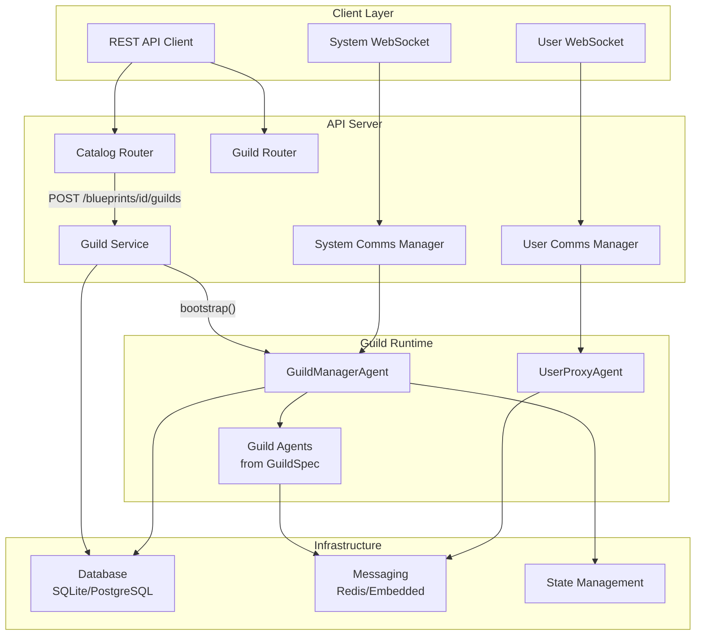
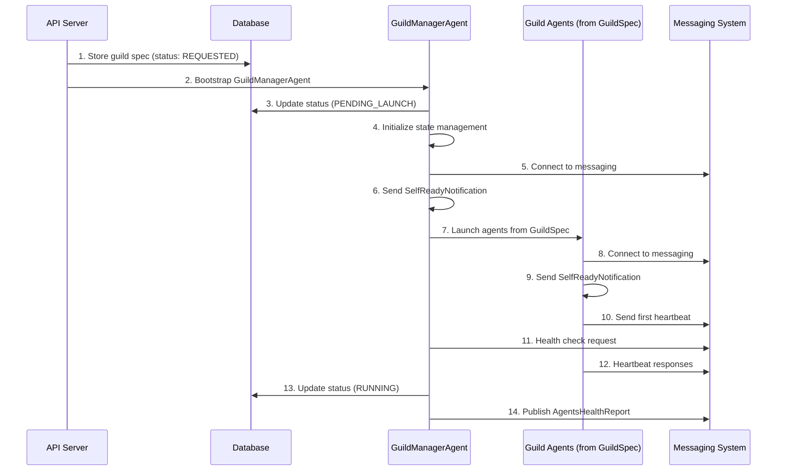
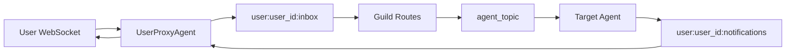

# Complete Client-Server Flow Guide

This comprehensive guide covers the entire client-server interaction flow in Rustic AI, from blueprint creation through real-time messaging. It combines frontend API calls, backend orchestration, WebSocket communication, and proper synchronization strategies for building robust client applications.

## Table of Contents

- [Overview](#overview)
- [Architecture Summary](#architecture-summary)
- [Phase 1: Blueprint &amp; Agent Setup](#phase-1-blueprint-agent-setup)
- [Phase 2: Guild Creation &amp; Bootstrap](#phase-2-guild-creation-bootstrap)
- [Phase 3: System WebSocket Connection](#phase-3-system-websocket-connection)
- [Phase 4: User WebSocket Connection](#phase-4-user-websocket-connection)
- [Phase 5: Real-time Messaging](#phase-5-real-time-messaging)
- [Message Formats Reference](#message-formats-reference)
- [Synchronization Strategy](#synchronization-strategy)
- [Error Handling](#error-handling)
- [Complete Example Implementation](#complete-example-implementation)

## Overview

The Rustic AI platform provides a sophisticated multi-agent system where clients interact through a combination of REST APIs and WebSocket connections. Understanding the proper flow and synchronization is crucial for building reliable applications.

### Key Concepts

- **Blueprints**: Templates that define agent configurations and guild specifications
- **Guilds**: Runtime instances of agent groups working together
- **System WebSocket**: For guild health monitoring and system operations
- **User WebSocket**: For real-time chat and user interactions
- **Agent Bootstrap**: The process of initializing and launching agents within a guild

## Architecture Summary



## Phase 1: Blueprint & Agent Setup

### 1.1 Register Agent in Catalog

Before creating blueprints, agents must be registered in the catalog.

**Endpoint**: `POST /catalog/agents`

```http
POST /catalog/agents
Content-Type: application/json

{
  "qualified_class_name": "rustic_ai.core.agents.testutils.echo_agent.EchoAgent",
  "description": "Agent that echoes messages back to the sender",
  "properties_schema": {},
  "dependencies": []
}
```

**Response**:
- `201 Created`: Agent registered successfully
- `409 Conflict`: Agent already exists

### 1.2 Create Category

Organize blueprints into categories for better management.

**Endpoint**: `POST /catalog/categories/`

```http
POST /catalog/categories/
Content-Type: application/json

{
  "name": "Testing",
  "description": "Category for integration testing blueprints"
}
```

**Response**: `{"id": "category_id"}`

### 1.3 Create Blueprint

Blueprints define the guild specification and agent configurations.

**Endpoint**: `POST /catalog/blueprints/`

```http
POST /catalog/blueprints/
Content-Type: application/json

{
  "name": "EchoTestBlueprint",
  "description": "Echo agent for integration testing",
  "version": "v1",
  "author_id": "test_author",
  "organization_id": "testorg456",
  "exposure": "private",
  "category_id": "{category_id}",
  "spec": {
    "name": "EchoTestBlueprint",
    "description": "Echo agent for integration testing",
    "agents": [
      {
        "name": "EchoAgent",
        "description": "Agent that echoes messages",
        "class_name": "rustic_ai.core.agents.testutils.echo_agent.EchoAgent",
        "additional_topics": ["echo_topic"],
        "listen_to_default_topic": false
      }
    ],
    "properties": {
      "messaging": {
        "backend_module": "rustic_ai.redis.messaging.backend",
        "backend_class": "RedisMessagingBackend",
        "backend_config": {
          "redis_client": {"host": "localhost", "port": 6379}
        }
      },
      "execution_engine": "rustic_ai.core.guild.execution.sync.sync_exec_engine.SyncExecutionEngine"
    }
  }
}
```

**Response**: `{"id": "blueprint_id"}`

## Phase 2: Guild Creation & Bootstrap

### 2.1 Launch Guild from Blueprint

**Endpoint**: `POST /catalog/blueprints/{blueprint_id}/guilds`

```http
POST /catalog/blueprints/{blueprint_id}/guilds
Content-Type: application/json

{
  "guild_name": "EchoTestGuild",
  "user_id": "testuser123",
  "org_id": "testorg456",
  "description": "My test guild"
}
```

**Response**: `{"id": "guild_id"}`

### 2.2 Backend Bootstrap Process

When a guild is launched, the following sequence occurs:



### 2.3 Guild State Transitions

| Status | Description | Next States |
|--------|-------------|-------------|
| `REQUESTED` | Guild creation requested | `PENDING_LAUNCH`, `ERROR` |
| `PENDING_LAUNCH` | GuildManagerAgent created | `STARTING`, `ERROR` |
| `STARTING` | Agents initializing | `RUNNING`, `ERROR` |
| `RUNNING` | All agents healthy | `WARNING`, `STOPPED` |
| `WARNING` | Some agents unhealthy | `RUNNING`, `ERROR` |
| `ERROR` | Critical failure | `STOPPED` |
| `STOPPED` | Guild shut down | - |

## Phase 3: System WebSocket Connection

### 3.1 Connection Establishment

**WebSocket URL**: `ws://host:port/ws/guilds/{guild_id}/syscomms/{user_id}`

```javascript
const systemWS = new WebSocket(`ws://localhost:8880/ws/guilds/${guild_id}/syscomms/${user_id}`);

systemWS.onopen = () => {
  console.log("System WebSocket connected");
};
```

### 3.2 Expected System Messages

#### AgentsHealthReport
Provides real-time guild and agent health status.

```json
{
  "format": "rustic_ai.core.guild.agent_ext.mixins.health.AgentsHealthReport",
  "payload": {
    "agents": {
      "agent_id_1": {
        "checktime": "2025-01-15T10:00:00.000Z",
        "checkstatus": "ok",
        "responsetime": "2025-01-15T10:00:00.005Z",
        "checkmeta": {
          "qos_latency": null,
          "observed_latency": 5.2
        }
      }
    },
    "guild_health": "ok"
  },
  "sender": {"id": "guild_manager_id", "name": "GuildManagerAgent"},
  "timestamp": 1642234567890
}
```

#### ParticipantList
List of all agents/participants in the guild.

```json
{
  "format": "Participants",
  "payload": {
    "participants": [
      {"id": "agent_id", "name": "EchoAgent", "type": "bot"},
      {"id": "user_agent_id", "name": "Test User", "type": "human"}
    ]
  }
}
```

### 3.3 System Commands

#### Request Participants
```javascript
systemWS.send(JSON.stringify({
  "format": "participantsRequest",
  "payload": {"guild_id": guild_id},
  "sender": {"id": user_id},
  "timestamp": new Date().toISOString(),
  "conversationId": "conv_123"
}));
```

#### Stop Guild
```javascript
systemWS.send(JSON.stringify({
  "format": "stopGuildRequest",
  "payload": {"guild_id": guild_id},
  "sender": {"id": user_id}
}));
```

## Phase 4: User WebSocket Connection

### 4.1 Connection Establishment

**WebSocket URL**: `ws://host:port/ws/guilds/{guild_id}/usercomms/{user_id}/{user_name}`

```javascript
const userName = encodeURIComponent("Test User");
const userWS = new WebSocket(`ws://localhost:8880/ws/guilds/${guild_id}/usercomms/${user_id}/${userName}`);
```

### 4.2 UserProxyAgent Auto-Creation

When a user WebSocket connects:

1. **UserAgentCreationRequest** is sent to the system
2. **GuildManagerAgent** creates a **UserProxyAgent**
3. **Updated AgentsHealthReport** includes the new agent
4. User can now send/receive messages

### 4.3 User Message Flow



## Phase 5: Real-time Messaging

### 5.1 Sending Messages

#### Text Message
```javascript
userWS.send(JSON.stringify({
  "id": "msg123",
  "format": "text",
  "payload": {"text": "Hello Echo!"},
  "sender": {"id": user_id, "name": user_name},
  "conversationId": "conv_789",
  "timestamp": new Date().toISOString()
}));
```

#### File Message
```javascript
userWS.send(JSON.stringify({
  "format": "rustic_ai.core.ui_protocol.types.FilesWithTextFormat",
  "payload": {
    "files": [{"name": "document.pdf", "url": "/files/document.pdf"}],
    "text": "Here's the document you requested",
    "tagged_users": []
  },
  "sender": {"id": user_id, "name": user_name}
}));
```

### 5.2 Receiving Messages

#### Echo Response
```json
{
  "id": 456789123,
  "format": "text",
  "payload": {"text": "Echo: Hello Echo!"},
  "sender": {"id": "echo_agent_id", "name": "EchoAgent"},
  "topics": ["user:testuser123:notifications"],
  "timestamp": 1642234567890,
  "thread": [123456789, 456789123],
  "in_response_to": 123456789,
  "priority": 4
}
```

## Message Formats Reference

### System WebSocket Formats

| Format | Purpose | Direction |
|--------|---------|-----------|
| `rustic_ai.core.guild.agent_ext.mixins.health.AgentsHealthReport` | Guild health status | Server → Client |
| `rustic_ai.core.guild.agent_ext.mixins.health.Heartbeat` | Individual agent heartbeat | Server → Client |
| `Participants` | Agent/participant list | Server → Client |
| `participantsRequest` | Request participant list | Client → Server |
| `stopGuildRequest` | Stop guild operation | Client → Server |

### User WebSocket Formats

| Format | Purpose | Direction |
|--------|---------|-----------|
| `text` | Simple text messages | Bidirectional |
| `rustic_ai.core.ui_protocol.types.TextFormat` | Structured text | Bidirectional |
| `rustic_ai.core.ui_protocol.types.FilesWithTextFormat` | Files with text | Bidirectional |
| `rustic_ai.core.agents.commons.message_formats.ErrorMessage` | Error messages | Server → Client |

### Common Message Properties

```typescript
interface Message {
  id: number;                    // Unique message ID
  format: string;                // Message format/type
  payload: object;               // Message content
  sender: {                      // Sender information
    id: string;
    name: string;
  };
  topics?: string[];             // Routing topics
  timestamp?: number;            // Unix timestamp
  thread?: number[];             // Message thread chain
  in_response_to?: number;       // Reply-to message ID
  traceparent?: string;          // Distributed tracing
  priority?: number;             // Priority (1-5)
  conversation_id?: string;      // Conversation grouping
}
```

## Synchronization Strategy

### Recommended Connection Flow

The proper synchronization strategy ensures reliable initialization:

```javascript
// State management
const ConnectionState = {
  DISCONNECTED: 'disconnected',
  SYSTEM_CONNECTED: 'system_connected',
  GUILD_INITIALIZING: 'guild_initializing', 
  USER_CONNECTING: 'user_connecting',
  AGENTS_READY: 'agents_ready',
  FULLY_READY: 'fully_ready',
  ERROR: 'error'
};

let currentState = ConnectionState.DISCONNECTED;
let firstHealthReportReceived = false;
let fullyReady = false;

// Step 1: Connect System WebSocket
function connectSystemWebSocket() {
  const systemWS = new WebSocket(`ws://host/ws/guilds/${guild_id}/syscomms/${user_id}`);
  
  systemWS.onopen = () => {
    currentState = ConnectionState.SYSTEM_CONNECTED;
    showStatus("Connected to guild system...");
  };
  
  systemWS.onmessage = (event) => {
    const message = JSON.parse(event.data);
    
    if (message.format === "rustic_ai.core.guild.agent_ext.mixins.health.AgentsHealthReport") {
      // Step 2: First health report received - guild is initializing
      if (!firstHealthReportReceived) {
        firstHealthReportReceived = true;
        currentState = ConnectionState.GUILD_INITIALIZING;
        showStatus("Guild initializing, connecting user session...");
        
        // NOW safe to connect User WebSocket
        connectUserWebSocket();
      }
      
      // Step 3: Guild health is "ok" - ready for messaging
      if (message.payload.guild_health === "ok" && !fullyReady) {
        fullyReady = true;
        currentState = ConnectionState.FULLY_READY;
        showStatus("Ready! Starting with participants request...");
        
        // NOW safe to start messaging
        sendParticipantsRequest();
      }
    }
  };
}

// Step 2: Connect User WebSocket (only after first health report)
function connectUserWebSocket() {
  const userWS = new WebSocket(`ws://host/ws/guilds/${guild_id}/usercomms/${user_id}/${userName}`);
  
  userWS.onopen = () => {
    currentState = ConnectionState.USER_CONNECTING;
    showStatus("User session connected, waiting for agents...");
  };
}

// Step 3: Start messaging (only after guild_health = "ok")
function sendParticipantsRequest() {
  systemWS.send(JSON.stringify({
    "format": "participantsRequest",
    "payload": {"guild_id": guild_id},
    "sender": {"id": user_id}
  }));
}
```

### Why This Strategy Works

1. **Eliminates Race Conditions**: No guessing when guild is ready
2. **Optimal Performance**: UserProxyAgent creation happens in parallel
3. **Clear Readiness Signals**: Each phase has explicit confirmation
4. **Better Error Handling**: Can detect initialization failures early
5. **Improved UX**: Clear progression feedback for users

### Timeout Handling

```javascript
const TIMEOUTS = {
  HEALTH_REPORT: 10000,  // 10 seconds for first health report
  READY_STATUS: 15000,   // 15 seconds for "ok" status
  CONNECTION: 5000       // 5 seconds for WebSocket connections
};

// Timeout for first health report
setTimeout(() => {
  if (!firstHealthReportReceived) {
    currentState = ConnectionState.ERROR;
    showError("Guild initialization timed out");
  }
}, TIMEOUTS.HEALTH_REPORT);

// Timeout for ready status
setTimeout(() => {
  if (!fullyReady) {
    currentState = ConnectionState.ERROR;
    showError("Guild failed to reach ready state");
  }
}, TIMEOUTS.READY_STATUS);
```

## Error Handling

### WebSocket Errors

```javascript
systemWS.onerror = (error) => {
  console.error("System WebSocket error:", error);
  currentState = ConnectionState.ERROR;
  showError("Connection to guild system failed");
};

systemWS.onclose = (event) => {
  if (currentState !== ConnectionState.FULLY_READY) {
    showError("Connection lost during initialization");
  } else {
    // Attempt reconnection
    reconnectWithBackoff();
  }
};
```

### Guild Health Errors

```javascript
if (message.payload.guild_health === "error") {
  currentState = ConnectionState.ERROR;
  showError("Guild failed to initialize properly");
  return;
}

if (message.payload.guild_health === "warning") {
  showWarning("Some agents are experiencing issues");
  // Continue operation but monitor
}
```

### Reconnection Strategy

```javascript
let reconnectAttempts = 0;
const MAX_RECONNECT_ATTEMPTS = 5;
const BACKOFF_BASE = 1000; // 1 second

function reconnectWithBackoff() {
  if (reconnectAttempts >= MAX_RECONNECT_ATTEMPTS) {
    showError("Maximum reconnection attempts reached");
    return;
  }
  
  const delay = BACKOFF_BASE * Math.pow(2, reconnectAttempts);
  reconnectAttempts++;
  
  setTimeout(() => {
    console.log(`Reconnection attempt ${reconnectAttempts}`);
    connectSystemWebSocket();
  }, delay);
}
```

## Complete Example Implementation

Here's a complete client implementation that demonstrates the proper flow:

```javascript
class RusticAIClient {
  constructor(baseUrl, guildId, userId, userName) {
    this.baseUrl = baseUrl;
    this.guildId = guildId;
    this.userId = userId;
    this.userName = userName;
    
    this.systemWS = null;
    this.userWS = null;
    this.state = 'disconnected';
    this.callbacks = {};
  }
  
  // Event handling
  on(event, callback) {
    this.callbacks[event] = this.callbacks[event] || [];
    this.callbacks[event].push(callback);
  }
  
  emit(event, data) {
    (this.callbacks[event] || []).forEach(cb => cb(data));
  }
  
  // Main connection flow
  async connect() {
    try {
      this.emit('status', 'Connecting to guild system...');
      await this.connectSystemWebSocket();
    } catch (error) {
      this.emit('error', `Connection failed: ${error.message}`);
    }
  }
  
  connectSystemWebSocket() {
    return new Promise((resolve, reject) => {
      const wsUrl = `ws://${this.baseUrl}/ws/guilds/${this.guildId}/syscomms/${this.userId}`;
      this.systemWS = new WebSocket(wsUrl);
      
      const healthTimeout = setTimeout(() => {
        reject(new Error('Guild initialization timeout'));
      }, 10000);
      
      this.systemWS.onopen = () => {
        this.state = 'system_connected';
        this.emit('status', 'Connected, waiting for guild initialization...');
      };
      
      this.systemWS.onmessage = (event) => {
        const message = JSON.parse(event.data);
        this.handleSystemMessage(message, resolve, healthTimeout);
      };
      
      this.systemWS.onerror = (error) => {
        clearTimeout(healthTimeout);
        reject(error);
      };
    });
  }
  
  handleSystemMessage(message, resolve, healthTimeout) {
    if (message.format === "rustic_ai.core.guild.agent_ext.mixins.health.AgentsHealthReport") {
      
      // First health report - connect user WebSocket
      if (this.state === 'system_connected') {
        this.state = 'guild_initializing';
        this.emit('status', 'Guild initializing, connecting user session...');
        this.connectUserWebSocket();
      }
      
      // Guild ready - start messaging
      if (message.payload.guild_health === "ok" && this.state !== 'ready') {
        this.state = 'ready';
        clearTimeout(healthTimeout);
        this.emit('status', 'Ready!');
        this.requestParticipants();
        resolve();
      }
      
      // Handle error states
      if (message.payload.guild_health === "error") {
        clearTimeout(healthTimeout);
        this.emit('error', 'Guild initialization failed');
      }
    }
    
    // Forward other system messages
    this.emit('system_message', message);
  }
  
  connectUserWebSocket() {
    const wsUrl = `ws://${this.baseUrl}/ws/guilds/${this.guildId}/usercomms/${this.userId}/${encodeURIComponent(this.userName)}`;
    this.userWS = new WebSocket(wsUrl);
    
    this.userWS.onopen = () => {
      this.emit('status', 'User session connected...');
    };
    
    this.userWS.onmessage = (event) => {
      const message = JSON.parse(event.data);
      this.emit('user_message', message);
    };
    
    this.userWS.onerror = (error) => {
      this.emit('error', `User connection error: ${error.message}`);
    };
  }
  
  // Messaging methods
  requestParticipants() {
    this.sendSystemMessage({
      format: "participantsRequest",
      payload: {guild_id: this.guildId},
      sender: {id: this.userId}
    });
  }
  
  sendChatMessage(text, conversationId = null) {
    if (this.state !== 'ready') {
      throw new Error('Client not ready for messaging');
    }
    
    this.sendUserMessage({
      format: "text",
      payload: {text},
      sender: {id: this.userId, name: this.userName},
      conversationId,
      timestamp: new Date().toISOString()
    });
  }
  
  sendSystemMessage(message) {
    if (this.systemWS?.readyState === WebSocket.OPEN) {
      this.systemWS.send(JSON.stringify(message));
    }
  }
  
  sendUserMessage(message) {
    if (this.userWS?.readyState === WebSocket.OPEN) {
      this.userWS.send(JSON.stringify(message));
    }
  }
  
  stopGuild() {
    this.sendSystemMessage({
      format: "stopGuildRequest",
      payload: {guild_id: this.guildId},
      sender: {id: this.userId}
    });
  }
  
  disconnect() {
    this.systemWS?.close();
    this.userWS?.close();
    this.state = 'disconnected';
  }
}

// Usage example
async function main() {
  const client = new RusticAIClient('localhost:8880', 'guild_123', 'user_456', 'Test User');
  
  // Set up event handlers
  client.on('status', (message) => console.log('Status:', message));
  client.on('error', (error) => console.error('Error:', error));
  client.on('system_message', (msg) => console.log('System:', msg));
  client.on('user_message', (msg) => console.log('Message:', msg));
  
  // Connect and start chatting
  await client.connect();
  
  // Send a test message
  client.sendChatMessage('Hello Echo!');
  
  // Stop guild after 30 seconds
  setTimeout(() => {
    client.stopGuild();
    client.disconnect();
  }, 30000);
}
```

This guide provides a complete foundation for building robust client applications that interact with the Rustic AI platform. The key is following the proper synchronization strategy and handling all the various message types and error conditions appropriately. 