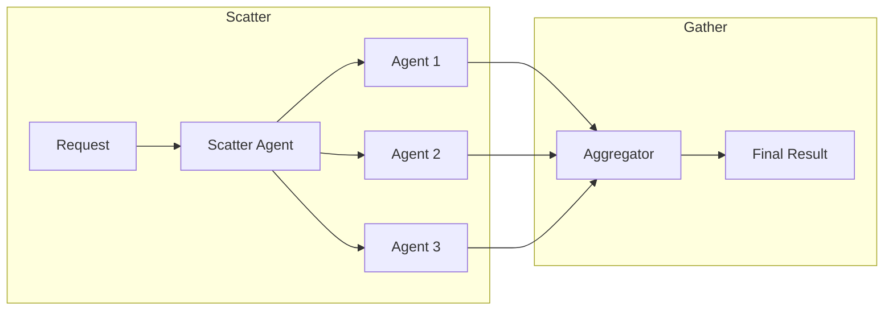
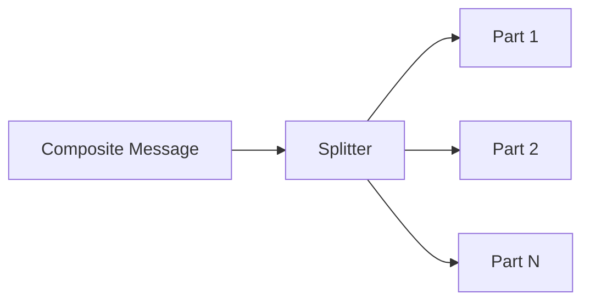
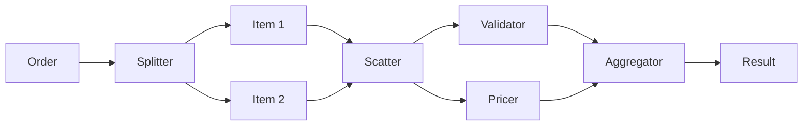

# Aggregation Patterns

Aggregation patterns combine multiple messages into one (gather) or split one message into many (scatter).

## Scatter-Gather

The Scatter-Gather pattern sends a message to multiple recipients and aggregates their responses into a single result.

### Pattern Overview



### When to Use

- Collecting data from multiple sources
- Parallel analysis with result consolidation
- Distributed processing with aggregation

### Key Components

| Component | Class | Purpose |
|-----------|-------|---------|
| Scatter Agent | `BasicWiringAgent` | Routes request to multiple destinations |
| Aggregator | `AggregatingAgent` | Collects and correlates responses |
| Collector | `DictCollector`, `ListCollector` | Deduplication strategy |
| Aggregation Strategy | `CountingAggregator`, `TimeoutAggregator` | Completion criteria |

### Implementation

```python
from rustic_ai.core.agents.eip.aggregating_agent import (
    AggregatingAgent,
    AggregatorConf,
    CountingAggregator,
    DictCollector,
    CorrelationLocation,
)
from rustic_ai.core.agents.eip import BasicWiringAgent
from rustic_ai.core.guild.builders import AgentBuilder, GuildBuilder, RouteBuilder
from rustic_ai.core.utils.jexpr import JObj, JxScript, JExpr
from rustic_ai.core.utils.basic_class_utils import get_qualified_class_name
from pydantic import BaseModel
from typing import List


# Message types
class AnalysisRequest(BaseModel):
    request_id: str
    data: List[float]


class AnalysisResult(BaseModel):
    correlation_id: str
    analysis_type: str
    result: dict


# Scatter agent
scatter_agent = (
    AgentBuilder(BasicWiringAgent)
    .set_id("ScatterAgent")
    .set_name("Scatter Agent")
    .add_additional_topic("analysis_requests")
    .build_spec()
)

# Aggregating agent
aggregator = (
    AgentBuilder(AggregatingAgent)
    .set_id("Aggregator")
    .set_name("Result Aggregator")
    .set_properties(
        AggregatorConf(
            correlation_location=CorrelationLocation.PAYLOAD,
            correlation_id_path="correlation_id",
            collector=DictCollector(key_field="analysis_type"),
            aggregator=CountingAggregator(count=3),  # Wait for 3 responses
        )
    )
    .add_additional_topic("analysis_results")
    .listen_to_default_topic(False)
    .build_spec()
)

# Scatter routes - transform and send to each analyzer
stats_route = (
    RouteBuilder(scatter_agent)
    .filter_on_origin(origin_message_format=get_qualified_class_name(AnalysisRequest))
    .set_payload_transformer(
        AnalysisResult,
        JxScript(JObj({
            "correlation_id": JExpr("request_id"),
            "data": JExpr("data"),
            "analysis_type": "statistics"
        }))
    )
    .set_destination_topics("statistics_analysis")
    .build()
)

trend_route = (
    RouteBuilder(scatter_agent)
    .filter_on_origin(origin_message_format=get_qualified_class_name(AnalysisRequest))
    .set_payload_transformer(
        AnalysisResult,
        JxScript(JObj({
            "correlation_id": JExpr("request_id"),
            "data": JExpr("data"),
            "analysis_type": "trends"
        }))
    )
    .set_destination_topics("trend_analysis")
    .build()
)

anomaly_route = (
    RouteBuilder(scatter_agent)
    .filter_on_origin(origin_message_format=get_qualified_class_name(AnalysisRequest))
    .set_payload_transformer(
        AnalysisResult,
        JxScript(JObj({
            "correlation_id": JExpr("request_id"),
            "data": JExpr("data"),
            "analysis_type": "anomalies"
        }))
    )
    .set_destination_topics("anomaly_analysis")
    .build()
)

# Build guild
guild = (
    GuildBuilder("scatter_gather", "Scatter-Gather Demo", "Parallel analysis demo")
    .add_agent_spec(scatter_agent)
    .add_agent_spec(aggregator)
    .add_route(stats_route)
    .add_route(trend_route)
    .add_route(anomaly_route)
    .launch("myorg")
)
```

### Aggregator Configuration

**AggregatorConf Parameters:**

| Parameter | Type | Description |
|-----------|------|-------------|
| `correlation_location` | `CorrelationLocation` | Where to find correlation ID |
| `correlation_id_path` | `str` | JSONPath to correlation ID |
| `collector` | `Collector` | Deduplication strategy |
| `aggregator` | `Aggregator` | Completion strategy |

**Correlation Location:**

```python
from rustic_ai.core.agents.eip.aggregating_agent import CorrelationLocation

# Extract from payload
CorrelationLocation.PAYLOAD  # Uses correlation_id_path

# Extract from message metadata
CorrelationLocation.MESSAGE  # Uses in_response_to or thread
```

**Collectors:**

```python
# Deduplicate by a key field (dict-based)
DictCollector(key_field="analysis_type")

# Keep all responses (list-based)
ListCollector()
```

**Aggregation Strategies:**

```python
# Wait for exact count
CountingAggregator(count=3)

# Wait for timeout (future)
TimeoutAggregator(timeout_ms=5000)
```

### Aggregated Output

The `AggregatingAgent` emits `AggregatedMessages`:

```python
class AggregatedMessages(BaseModel):
    correlation_id: str
    messages: List[dict]  # Collected message payloads
```

### YAML Configuration

```yaml
agents:
  - id: ScatterAgent
    name: Scatter Agent
    class_name: rustic_ai.core.agents.eip.BasicWiringAgent
    additional_topics:
      - analysis_requests

  - id: Aggregator
    name: Result Aggregator
    class_name: rustic_ai.core.agents.eip.aggregating_agent.AggregatingAgent
    additional_topics:
      - analysis_results
    listen_to_default_topic: false
    properties:
      correlation_location: payload
      correlation_id_path: correlation_id
      collector:
        type: dict
        key_field: analysis_type
      aggregator:
        type: counting
        count: 3

routes:
  steps:
    - agent:
        name: Scatter Agent
      origin_filter:
        message_format: mypackage.AnalysisRequest
      transformer:
        type: payload
        target_format: mypackage.StatsRequest
        script: '{"correlation_id": request_id, "data": data, "analysis_type": "statistics"}'
      destination:
        topics: statistics_analysis
    # ... additional scatter routes
```

## Splitter

The Splitter pattern breaks a composite message into individual parts for independent processing.

### Pattern Overview



### When to Use

- Processing items in a collection independently
- Parallel processing of message parts
- Breaking down batch operations

### Key Components

| Component | Class | Purpose |
|-----------|-------|---------|
| Splitter Agent | `SplitterAgent` | Splits messages |
| Splitter Strategy | `ListSplitter`, `TokenizerSplitter` | How to split |
| Format Selector | `FixedFormatSelector`, `ListFormatSelector` | Output format |

### Implementation

```python
from rustic_ai.core.agents.eip.splitter_agent import (
    SplitterAgent,
    SplitterConf,
    ListSplitter,
    FixedFormatSelector,
)
from rustic_ai.core.guild.builders import AgentBuilder, GuildBuilder, RouteBuilder
from rustic_ai.core.utils.basic_class_utils import get_qualified_class_name
from pydantic import BaseModel
from typing import List, Dict, Any


class PurchaseOrder(BaseModel):
    order_id: str
    customer: str
    items: List[Dict[str, Any]]


class OrderItem(BaseModel):
    id: str
    quantity: int


# Configure splitter
splitter_conf = SplitterConf(
    splitter=ListSplitter(field_name="items"),
    format_selector=FixedFormatSelector(
        strategy="fixed",
        fixed_format=get_qualified_class_name(OrderItem)
    )
)

splitter_agent = (
    AgentBuilder(SplitterAgent)
    .set_id("OrderSplitter")
    .set_name("Order Splitter")
    .set_description("Splits purchase orders into individual items")
    .set_properties(splitter_conf)
    .add_additional_topic("purchase_orders")
    .listen_to_default_topic(False)
    .build_spec()
)

# Route split items
item_route = (
    RouteBuilder(splitter_agent)
    .on_message_format(OrderItem)
    .set_destination_topics("item_processing")
    .set_route_times(-1)  # Route all split items
    .build()
)

guild = (
    GuildBuilder("splitter_guild", "Splitter Demo", "Message splitting demo")
    .add_agent_spec(splitter_agent)
    .add_route(item_route)
    .launch("myorg")
)
```

### Splitter Configuration

**SplitterConf Parameters:**

| Parameter | Type | Description |
|-----------|------|-------------|
| `splitter` | `Splitter` | Splitting strategy |
| `format_selector` | `FormatSelector` | Output format strategy |

**Splitter Strategies:**

```python
# Split a list field
ListSplitter(field_name="items")

# Split text by tokens (future)
TokenizerSplitter(delimiter="\n")
```

**Format Selectors:**

```python
# All outputs have the same format
FixedFormatSelector(
    strategy="fixed",
    fixed_format="mypackage.ItemMessage"
)

# Each output can have different format
ListFormatSelector(
    strategy="list",
    formats=["mypackage.TypeA", "mypackage.TypeB"]
)
```

### Route Times

Use `set_route_times(-1)` to route all split messages:

```python
route = (
    RouteBuilder(splitter_agent)
    .on_message_format(OrderItem)
    .set_destination_topics("items")
    .set_route_times(-1)  # -1 means route all
    .build()
)
```

### YAML Configuration

```yaml
agents:
  - id: OrderSplitter
    name: Order Splitter
    class_name: rustic_ai.core.agents.eip.splitter_agent.SplitterAgent
    additional_topics:
      - purchase_orders
    listen_to_default_topic: false
    properties:
      splitter:
        split_type: list
        field_name: items
      format_selector:
        strategy: fixed
        fixed_format: mypackage.OrderItem

routes:
  steps:
    - agent:
        name: Order Splitter
      message_format: mypackage.OrderItem
      destination:
        topics: item_processing
      route_times: -1
```

### Combining Splitter with Scatter-Gather

For complex workflows, combine splitting with scatter-gather:



## Related Patterns

- [Content-Based Router](routing.md#content-based-router) - Route split items differently
- [Functional Transformer](transformation.md#functional-transformer) - Transform before/after aggregation
- [Point-to-Point](messaging.md#point-to-point) - Send aggregated result to specific agent

## Jupyter Notebooks

- `examples/notebooks/eip/006_scatter_gather.ipynb`
- `examples/notebooks/eip/006_scatter_gather_yaml.ipynb`
- `examples/notebooks/eip/007_splitter.ipynb`
- `examples/notebooks/eip/007_splitter_yaml.ipynb`
