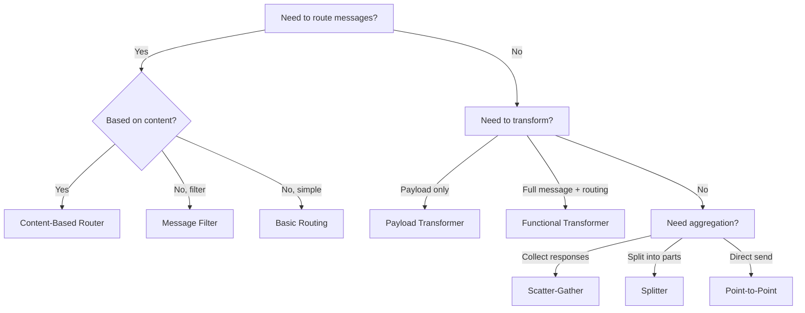

# Enterprise Integration Patterns

Rustic AI implements key [Enterprise Integration Patterns (EIP)](https://www.enterpriseintegrationpatterns.com/) to enable robust, scalable multi-agent communication. These patterns provide battle-tested solutions for message routing, transformation, and aggregation.

## Why EIP for Multi-Agent Systems?

Enterprise Integration Patterns were originally designed for connecting disparate enterprise systems. They're equally valuable for multi-agent architectures because:

- **Decoupling**: Agents don't need to know about each other's internals
- **Scalability**: Patterns like scatter-gather enable parallel processing
- **Flexibility**: Routing rules can be changed without modifying agents
- **Reliability**: Patterns handle edge cases like message filtering and aggregation

## Pattern Categories

### Messaging Patterns

Basic patterns for sending messages between agents.

| Pattern | Description | Documentation |
|---------|-------------|---------------|
| Point-to-Point | Direct agent-to-agent communication | [Messaging Patterns](messaging.md#point-to-point) |
| Basic Routing | Simple topic-based message routing | [Messaging Patterns](messaging.md#basic-message-routing) |

### Routing Patterns

Patterns for directing messages based on content or rules.

| Pattern | Description | Documentation |
|---------|-------------|---------------|
| Content-Based Router | Route messages based on payload content | [Routing Patterns](routing.md#content-based-router) |
| Message Filter | Conditionally accept or reject messages | [Routing Patterns](routing.md#message-filter) |

### Transformation Patterns

Patterns for modifying message content and structure.

| Pattern | Description | Documentation |
|---------|-------------|---------------|
| Functional Transformer | Transform entire message including routing | [Transformation Patterns](transformation.md#functional-transformer) |
| Payload Transformer | Transform only the message payload | [Transformation Patterns](transformation.md#payload-transformer) |

### Aggregation Patterns

Patterns for combining multiple messages.

| Pattern | Description | Documentation |
|---------|-------------|---------------|
| Scatter-Gather | Send to many, collect responses | [Aggregation Patterns](aggregation.md#scatter-gather) |
| Splitter | Break composite message into parts | [Aggregation Patterns](aggregation.md#splitter) |

## Core Components

### BasicWiringAgent

The `BasicWiringAgent` is the foundation for many EIP patterns. It receives messages and forwards them according to routing rules.

```python
from rustic_ai.core.agents.eip import BasicWiringAgent
from rustic_ai.core.guild.builders import AgentBuilder

agent = (
    AgentBuilder(BasicWiringAgent)
    .set_id("RouterAgent")
    .set_name("Message Router")
    .set_description("Routes messages based on content")
    .build_spec()
)
```

### RouteBuilder

The `RouteBuilder` creates routing rules that define how messages flow through the system.

```python
from rustic_ai.core.guild.builders import RouteBuilder

route = (
    RouteBuilder(source_agent)
    .filter_on_origin(origin_message_format="mypackage.MyMessage")
    .set_destination_topics("output_topic")
    .build()
)
```

### JxScript and JSONata

Many patterns use JSONata expressions for dynamic transformations and routing decisions.

```python
from rustic_ai.core.utils import jx
from rustic_ai.core.utils.jexpr import JObj, JxScript

# Route based on payload field
routing_script = JxScript(
    JObj({
        "topics": jx.JExpr("payload").routing_key
    })
)
```

## Quick Start Example

Here's a minimal example implementing a content-based router:

```python
from pydantic import BaseModel
from rustic_ai.core.agents.eip import BasicWiringAgent
from rustic_ai.core.guild.builders import AgentBuilder, GuildBuilder, RouteBuilder
from rustic_ai.core.utils import jx
from rustic_ai.core.utils.jexpr import JObj, JxScript
from rustic_ai.core.utils.basic_class_utils import get_qualified_class_name


class OrderMessage(BaseModel):
    priority: str  # "high" or "normal"
    content: str


# Create the routing agent
router = (
    AgentBuilder(BasicWiringAgent)
    .set_id("OrderRouter")
    .set_name("Order Router")
    .build_spec()
)

# Create routing rule that directs messages based on priority
routing_script = JxScript(
    JObj({
        "topics": jx.ternary(
            jx.JExpr("payload.priority") == "high",
            "priority_queue",
            "normal_queue"
        )
    })
)

route = (
    RouteBuilder(router)
    .filter_on_origin(origin_message_format=get_qualified_class_name(OrderMessage))
    .set_functional_transformer(routing_script)
    .build()
)

# Build the guild
guild = (
    GuildBuilder("order_routing", "Order Routing", "Routes orders by priority")
    .add_agent_spec(router)
    .add_route(route)
    .launch("myorg")
)
```

## Jupyter Notebook Examples

Interactive examples are available in the repository:

| Notebook | Pattern | Path |
|----------|---------|------|
| 001 | Point-to-Point | `examples/notebooks/eip/001_point_to_point.ipynb` |
| 002 | Basic Message Routing | `examples/notebooks/eip/002_basic_message_routing.ipynb` |
| 003 | Content-Based Router | `examples/notebooks/eip/003_content_based_router.ipynb` |
| 004 | Message Filter | `examples/notebooks/eip/004_message_filter.ipynb` |
| 005a | Functional Transformer | `examples/notebooks/eip/005_message_translator_functional.ipynb` |
| 005b | Payload Transformer | `examples/notebooks/eip/005_message_translator_payload.ipynb` |
| 006 | Scatter-Gather | `examples/notebooks/eip/006_scatter_gather.ipynb` |
| 007 | Splitter | `examples/notebooks/eip/007_splitter.ipynb` |

YAML variants are also available (e.g., `001_point_to_point_yaml.ipynb`).

## Pattern Selection Guide



## Related Documentation

- [Messaging](../core/messaging.md) - Core messaging concepts
- [Guilds](../core/guilds.md) - Guild architecture
- [Creating a Guild](../howto/creating_a_guild.md) - Guild setup guide
