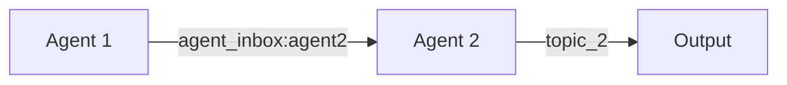
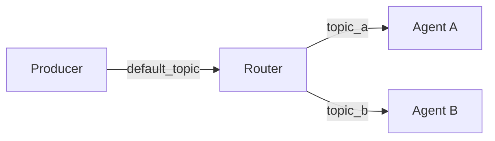

# Messaging Patterns

Basic messaging patterns enable direct communication between agents in a guild.

## Point-to-Point

The Point-to-Point pattern enables direct communication from one agent to another using dedicated inbox topics.

### Pattern Overview



Every agent in Rustic AI automatically listens to special topics:

- `agent_self_inbox:{agent_id}` - Messages from self
- `agent_inbox:{agent_id}` - Messages from other agents

### When to Use

- Direct agent-to-agent communication
- Request-response patterns between specific agents
- Workflows where message order matters

### Implementation

```python
from rustic_ai.core.agents.eip import BasicWiringAgent
from rustic_ai.core.guild.builders import AgentBuilder, GuildBuilder, RouteBuilder
from rustic_ai.core.guild.dsl import GuildTopics

# Create two agents - agent2 doesn't listen to default topic
agent1 = (
    AgentBuilder(BasicWiringAgent)
    .set_name("Agent1")
    .set_id("agent1")
    .set_description("Sender agent")
    .build_spec()
)

agent2 = (
    AgentBuilder(BasicWiringAgent)
    .set_name("Agent2")
    .set_id("agent2")
    .set_description("Receiver agent")
    .listen_to_default_topic(False)  # Only receives via inbox
    .build_spec()
)

# Route from agent1 to agent2's inbox
p2p_route = (
    RouteBuilder(agent1)
    .set_destination_topics(GuildTopics.get_agent_inbox(agent2.id))
    .build()
)

# Build guild
guild = (
    GuildBuilder("p2p_guild", "P2P Demo", "Point-to-point messaging demo")
    .add_agent_spec(agent1)
    .add_agent_spec(agent2)
    .add_route(p2p_route)
    .launch("myorg")
)
```

### YAML Configuration

```yaml
agents:
  - id: agent1
    name: Agent1
    class_name: rustic_ai.core.agents.eip.BasicWiringAgent
    listen_to_default_topic: true

  - id: agent2
    name: Agent2
    class_name: rustic_ai.core.agents.eip.BasicWiringAgent
    listen_to_default_topic: false

routes:
  steps:
    - agent:
        name: Agent1
      destination:
        topics: "agent_inbox:agent2"
```

### Key Concepts

**Agent Inbox Topics**

Use `GuildTopics.get_agent_inbox(agent_id)` to get the inbox topic for a specific agent:

```python
from rustic_ai.core.guild.dsl import GuildTopics

inbox_topic = GuildTopics.get_agent_inbox("my_agent_id")
# Returns: "agent_inbox:my_agent_id"
```

**Disabling Default Topic**

By default, agents listen to the guild's default topic. Disable this for agents that should only receive targeted messages:

```python
agent = (
    AgentBuilder(BasicWiringAgent)
    .listen_to_default_topic(False)
    .build_spec()
)
```

## Basic Message Routing

Basic message routing uses topic-based addressing to direct messages to interested agents.

### Pattern Overview



### When to Use

- Broadcasting messages to multiple consumers
- Decoupling producers from consumers
- Topic-based pub/sub architectures

### Implementation

```python
from rustic_ai.core.agents.eip import BasicWiringAgent
from rustic_ai.core.guild.builders import AgentBuilder, GuildBuilder, RouteBuilder

# Router agent that forwards messages
router = (
    AgentBuilder(BasicWiringAgent)
    .set_id("router")
    .set_name("Message Router")
    .build_spec()
)

# Consumer agents listening to specific topics
consumer_a = (
    AgentBuilder(BasicWiringAgent)
    .set_id("consumer_a")
    .set_name("Consumer A")
    .add_additional_topic("topic_a")
    .listen_to_default_topic(False)
    .build_spec()
)

consumer_b = (
    AgentBuilder(BasicWiringAgent)
    .set_id("consumer_b")
    .set_name("Consumer B")
    .add_additional_topic("topic_b")
    .listen_to_default_topic(False)
    .build_spec()
)

# Route to both topics (broadcast)
route_to_a = (
    RouteBuilder(router)
    .set_destination_topics("topic_a")
    .build()
)

route_to_b = (
    RouteBuilder(router)
    .set_destination_topics("topic_b")
    .build()
)

guild = (
    GuildBuilder("routing_guild", "Routing Demo", "Basic routing demo")
    .add_agent_spec(router)
    .add_agent_spec(consumer_a)
    .add_agent_spec(consumer_b)
    .add_route(route_to_a)
    .add_route(route_to_b)
    .launch("myorg")
)
```

### Multi-Topic Routing

Route to multiple topics simultaneously:

```python
route = (
    RouteBuilder(router)
    .set_destination_topics(["topic_a", "topic_b", "topic_c"])
    .build()
)
```

### Topic Subscriptions

Agents can subscribe to multiple topics:

```python
agent = (
    AgentBuilder(BasicWiringAgent)
    .add_additional_topic("orders")
    .add_additional_topic("notifications")
    .add_additional_topic("alerts")
    .build_spec()
)
```

## Related Patterns

- [Content-Based Router](routing.md#content-based-router) - Route based on message content
- [Message Filter](routing.md#message-filter) - Conditionally accept messages
- [Scatter-Gather](aggregation.md#scatter-gather) - Send to many, collect responses

## Jupyter Notebooks

- `examples/notebooks/eip/001_point_to_point.ipynb`
- `examples/notebooks/eip/001_point_to_point_yaml.ipynb`
- `examples/notebooks/eip/002_basic_message_routing.ipynb`
- `examples/notebooks/eip/002_basic_message_routing_yaml.ipynb`
