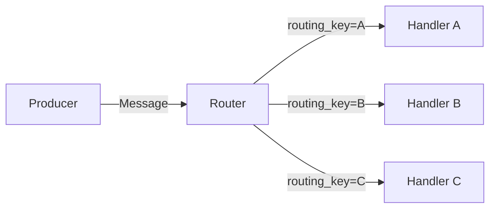
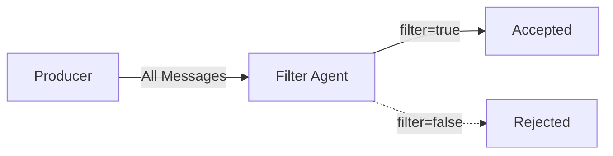

# Routing Patterns

Routing patterns direct messages to different destinations based on content, rules, or conditions.

## Content-Based Router

The Content-Based Router examines message content and routes to different destinations based on the data.

### Pattern Overview



### When to Use

- Different message types need different processing
- Dynamic routing based on payload fields
- Implementing routing rules without code changes

### Implementation

```python
from pydantic import BaseModel
from rustic_ai.core.agents.eip import BasicWiringAgent
from rustic_ai.core.guild.builders import AgentBuilder, GuildBuilder, RouteBuilder
from rustic_ai.core.utils import jx
from rustic_ai.core.utils.jexpr import JObj, JxScript
from rustic_ai.core.utils.basic_class_utils import get_qualified_class_name


class RoutableMessage(BaseModel):
    routing_key: str
    body: str


# Create the routing agent
routing_agent = (
    AgentBuilder(BasicWiringAgent)
    .set_id("ContentRouter")
    .set_name("Content-Based Router")
    .set_description("Routes messages based on their routing_key field")
    .build_spec()
)

# Create a JxScript to determine destination from payload
routing_script = JxScript(
    JObj({
        "topics": jx.JExpr("payload").routing_key
    })
)

# Create the routing rule
routing_rule = (
    RouteBuilder(routing_agent)
    .filter_on_origin(origin_message_format=get_qualified_class_name(RoutableMessage))
    .set_functional_transformer(routing_script)
    .build()
)

guild = (
    GuildBuilder("cbr_guild", "Content Router", "Content-based routing demo")
    .add_agent_spec(routing_agent)
    .add_route(routing_rule)
    .launch("myorg")
)
```

### Advanced Routing Logic

Use JSONata expressions for complex routing decisions:

```python
from rustic_ai.core.utils import jx
from rustic_ai.core.utils.jexpr import JObj, JxScript

# Route based on multiple conditions
routing_script = JxScript(
    jx.assign("$priority", jx.JExpr("payload.priority")),
    jx.assign("$value", jx.JExpr("payload.order_value")),

    JObj({
        "topics": jx.ternary(
            jx.JExpr("$priority = 'urgent' or $value > 10000"),
            "high_priority_queue",
            jx.ternary(
                jx.JExpr("$value > 1000"),
                "normal_queue",
                "low_priority_queue"
            )
        )
    })
)
```

### YAML Configuration

```yaml
agents:
  - id: ContentRouter
    name: Content-Based Router
    class_name: rustic_ai.core.agents.eip.BasicWiringAgent

routes:
  steps:
    - agent:
        name: Content-Based Router
      origin_filter:
        message_format: mypackage.models.RoutableMessage
      transformer:
        type: functional
        script: '{"topics": payload.routing_key}'
```

## Message Filter

The Message Filter pattern conditionally accepts or rejects messages based on runtime predicates.

### Pattern Overview



### When to Use

- Filtering out unwanted messages
- Conditional processing based on message or state
- Implementing access control

### Implementation

```python
from pydantic import BaseModel
from rustic_ai.core.agents.eip import BasicWiringAgent
from rustic_ai.core.guild.builders import AgentBuilder, GuildBuilder, RouteBuilder
from rustic_ai.core.guild.dsl import SimpleRuntimePredicate
from rustic_ai.core.utils import jx
from rustic_ai.core.utils.jexpr import JxScript
from rustic_ai.core.utils.basic_class_utils import get_qualified_class_name


class FilterableMessage(BaseModel):
    filter: bool
    content: str


# Create filter expression
# The predicate can access: message, agent_state, guild_state
filter_predicate = JxScript(jx.JExpr("message.payload.filter"))

filtering_agent = (
    AgentBuilder(BasicWiringAgent)
    .set_id("FilterAgent")
    .set_name("Message Filter")
    .set_description("Filters messages based on payload.filter field")
    .add_predicate(
        BasicWiringAgent.wire_message.__name__,
        SimpleRuntimePredicate(expression=filter_predicate.serialize())
    )
    .build_spec()
)

# Route accepted messages
route = (
    RouteBuilder(filtering_agent)
    .filter_on_origin(origin_message_format=get_qualified_class_name(FilterableMessage))
    .set_destination_topics("accepted")
    .build()
)

guild = (
    GuildBuilder("filter_guild", "Filter Demo", "Message filtering demo")
    .add_agent_spec(filtering_agent)
    .add_route(route)
    .launch("myorg")
)
```

### Predicate Context

Runtime predicates have access to:

| Variable | Description |
|----------|-------------|
| `message` | The complete incoming message (dict) |
| `agent_state` | Current agent state (dict) |
| `guild_state` | Current guild state (dict) |

### Advanced Filter Examples

**Filter by message type and content:**

```python
predicate = JxScript(
    jx.JExpr('message.format = "mypackage.ImportantMessage" and message.payload.priority > 5')
)
```

**Filter using agent state:**

```python
predicate = JxScript(
    jx.JExpr('message.payload.user_id in agent_state.allowed_users')
)
```

**Filter using guild state:**

```python
predicate = JxScript(
    jx.JExpr('guild_state.processing_enabled = true and message.payload.type != "maintenance"')
)
```

### YAML Configuration

```yaml
agents:
  - id: FilterAgent
    name: Message Filter
    class_name: rustic_ai.core.agents.eip.BasicWiringAgent
    predicates:
      wire_message:
        type: simple
        expression: "message.payload.filter"

routes:
  steps:
    - agent:
        name: Message Filter
      origin_filter:
        message_format: mypackage.models.FilterableMessage
      destination:
        topics: accepted
```

### Combining Routing and Filtering

You can combine content-based routing with filtering:

```python
# First filter, then route
filtering_agent = (
    AgentBuilder(BasicWiringAgent)
    .set_id("FilterRouter")
    .add_predicate(
        BasicWiringAgent.wire_message.__name__,
        SimpleRuntimePredicate(expression="message.payload.enabled = true")
    )
    .build_spec()
)

# Only process enabled messages, route by type
routing_rule = (
    RouteBuilder(filtering_agent)
    .set_functional_transformer(JxScript(
        JObj({"topics": jx.JExpr("payload.message_type")})
    ))
    .build()
)
```

## Related Patterns

- [Point-to-Point](messaging.md#point-to-point) - Direct agent communication
- [Functional Transformer](transformation.md#functional-transformer) - Transform with routing
- [Scatter-Gather](aggregation.md#scatter-gather) - Route to multiple, aggregate responses

## Jupyter Notebooks

- `examples/notebooks/eip/003_content_based_router.ipynb`
- `examples/notebooks/eip/003_content_based_router_yaml.ipynb`
- `examples/notebooks/eip/004_message_filter.ipynb`
- `examples/notebooks/eip/004_message_filter_yaml.ipynb`
