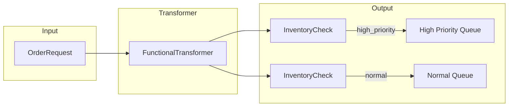
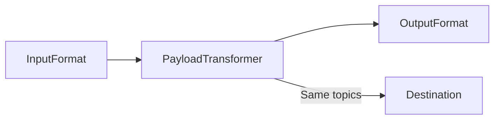

# Transformation Patterns

Transformation patterns modify message content, structure, or routing information as messages flow through the system.

## Functional Transformer

The Functional Transformer modifies the entire `MessageRoutable` structure, including payload, topics, format, and routing information.

### Pattern Overview



### When to Use

- Transforming message format between systems
- Dynamic routing based on transformed values
- Complex transformations with intermediate calculations

### MessageRoutable Fields

The transformer can modify any of these fields:

| Field | Type | Description |
|-------|------|-------------|
| `topics` | `Union[str, List[str]]` | Destination topics |
| `recipient_list` | `List[AgentTag]` | Tagged recipient agents |
| `payload` | `JsonDict` | Message content |
| `format` | `str` | Payload type (FQCN) |
| `forward_header` | `Optional[ForwardHeader]` | Forwarding metadata |
| `context` | `Optional[JsonDict]` | Message context |
| `enrich_with_history` | `Optional[int]` | History enrichment count |

### Implementation

```python
from pydantic import BaseModel
from typing import List
from rustic_ai.core.agents.eip import BasicWiringAgent
from rustic_ai.core.guild.builders import AgentBuilder, GuildBuilder, RouteBuilder
from rustic_ai.core.utils import jx
from rustic_ai.core.utils.jexpr import JObj, JxScript
from rustic_ai.core.utils.basic_class_utils import get_qualified_class_name


# Input format
class OrderItem(BaseModel):
    product_id: str
    quantity: int
    unit_price: float


class OrderRequest(BaseModel):
    order_id: str
    customer_id: str
    items: List[OrderItem]


# Output format
class InventoryCheck(BaseModel):
    check_id: str
    order_reference: str
    items_to_check: List[dict]
    total_value: float
    priority_level: str


# Create transformer agent
transformer = (
    AgentBuilder(BasicWiringAgent)
    .set_id("Transformer")
    .set_name("Order Transformer")
    .build_spec()
)

# Create transformation script with dynamic routing
transformation_script = JxScript(
    # Calculate order total
    jx.assign("$order_total", jx.JExpr("$sum(payload.items.(quantity * unit_price))")),

    # Determine priority based on total
    jx.assign("$is_high_priority", jx.JExpr("$order_total > 1000")),
    jx.assign("$priority_level", jx.ternary("$is_high_priority", "high", "normal")),
    jx.assign("$routing_topic", jx.ternary("$is_high_priority", "high_priority", "normal")),

    # Transform items
    jx.assign("$inventory_items", jx.JExpr("""
        payload.items.{
            "sku": product_id,
            "requested_quantity": quantity
        }
    """)),

    # Generate check ID
    jx.assign("$check_id", jx.JExpr('"INV-" & $string($millis())')),

    # Build transformed payload
    jx.assign("$transformed_payload", JObj({
        "check_id": jx.JExpr("$check_id"),
        "order_reference": jx.JExpr("payload.order_id"),
        "items_to_check": jx.JExpr("$inventory_items"),
        "total_value": jx.JExpr("$order_total"),
        "priority_level": jx.JExpr("$priority_level")
    })),

    # Final MessageRoutable with dynamic routing
    JObj({
        "payload": jx.JExpr("$transformed_payload"),
        "topics": jx.JExpr("$routing_topic"),
        "format": get_qualified_class_name(InventoryCheck)
    })
)

# Create routing rule with transformer
transform_rule = (
    RouteBuilder(transformer)
    .filter_on_origin(origin_message_format=get_qualified_class_name(OrderRequest))
    .set_functional_transformer(transformation_script)
    .build()
)

guild = (
    GuildBuilder("transform_guild", "Transform Demo", "Functional transformation demo")
    .add_agent_spec(transformer)
    .add_route(transform_rule)
    .launch("myorg")
)
```

### JxScript Building Blocks

**Variable Assignment:**

```python
jx.assign("$varname", expression)
```

**Ternary Conditions:**

```python
jx.ternary(condition, if_true, if_false)
```

**Object Construction:**

```python
JObj({
    "field1": jx.JExpr("payload.value"),
    "field2": "literal_value",
    "field3": jx.JExpr("$computed_var")
})
```

**String Operations:**

```python
jx.string(value)           # Convert to string
jx.substring(str, start, len)
jx.substringBefore(str, char)
```

**Numeric Operations:**

```python
jx.millis()                # Current timestamp
jx.JExpr("$sum(array)")    # Sum array values
jx.JExpr("$count(array)")  # Count elements
```

## Payload Transformer

The Payload Transformer modifies only the message payload, keeping routing and metadata unchanged.

### Pattern Overview



### When to Use

- Simple format conversion
- When routing doesn't need to change
- Adapting between different message schemas

### Implementation

```python
from pydantic import BaseModel
from rustic_ai.core.agents.eip import BasicWiringAgent
from rustic_ai.core.guild.builders import AgentBuilder, GuildBuilder, RouteBuilder
from rustic_ai.core.utils.jexpr import JObj, JxScript, JExpr
from rustic_ai.core.utils.basic_class_utils import get_qualified_class_name


class LegacyOrder(BaseModel):
    orderNumber: str
    customerName: str
    totalAmount: float


class ModernOrder(BaseModel):
    order_id: str
    customer: str
    amount: float


transformer = (
    AgentBuilder(BasicWiringAgent)
    .set_id("PayloadTransformer")
    .set_name("Format Adapter")
    .build_spec()
)

# Payload-only transformation
payload_script = JxScript(
    JObj({
        "order_id": JExpr("orderNumber"),
        "customer": JExpr("customerName"),
        "amount": JExpr("totalAmount")
    })
)

transform_rule = (
    RouteBuilder(transformer)
    .filter_on_origin(origin_message_format=get_qualified_class_name(LegacyOrder))
    .set_payload_transformer(ModernOrder, payload_script)
    .set_destination_topics("orders")
    .build()
)

guild = (
    GuildBuilder("payload_transform", "Payload Transform", "Payload transformation demo")
    .add_agent_spec(transformer)
    .add_route(transform_rule)
    .launch("myorg")
)
```

### Comparison: Functional vs Payload Transformer

| Feature | Functional Transformer | Payload Transformer |
|---------|----------------------|---------------------|
| Modifies payload | Yes | Yes |
| Modifies topics | Yes | No |
| Modifies format | Yes | Yes (via parameter) |
| Dynamic routing | Yes | No |
| Complexity | Higher | Lower |

### YAML Configuration

**Functional Transformer:**

```yaml
routes:
  steps:
    - agent:
        name: Transformer
      origin_filter:
        message_format: mypackage.OrderRequest
      transformer:
        type: functional
        script: |
          {
            "payload": {
              "id": payload.order_id,
              "total": $sum(payload.items.price)
            },
            "topics": payload.priority = "high" ? "urgent" : "normal",
            "format": "mypackage.ProcessedOrder"
          }
```

**Payload Transformer:**

```yaml
routes:
  steps:
    - agent:
        name: Transformer
      origin_filter:
        message_format: mypackage.LegacyOrder
      transformer:
        type: payload
        target_format: mypackage.ModernOrder
        script: |
          {
            "order_id": orderNumber,
            "customer": customerName,
            "amount": totalAmount
          }
      destination:
        topics: orders
```

### Common Transformation Patterns

**Array Mapping:**

```python
JxScript(JObj({
    "items": JExpr("items.{ \"name\": title, \"price\": cost }")
}))
```

**Conditional Fields:**

```python
JxScript(JObj({
    "status": jx.ternary(
        JExpr("is_active"),
        "active",
        "inactive"
    )
}))
```

**Aggregation:**

```python
JxScript(
    jx.assign("$total", JExpr("$sum(items.amount)")),
    jx.assign("$count", JExpr("$count(items)")),
    JObj({
        "total_amount": JExpr("$total"),
        "item_count": JExpr("$count"),
        "average": JExpr("$total / $count")
    })
)
```

## Related Patterns

- [Content-Based Router](routing.md#content-based-router) - Route based on content
- [Scatter-Gather](aggregation.md#scatter-gather) - Transform before scattering
- [Splitter](aggregation.md#splitter) - Split then transform each part

## Jupyter Notebooks

- `examples/notebooks/eip/005_message_translator_functional.ipynb`
- `examples/notebooks/eip/005_message_translator_functional_yaml.ipynb`
- `examples/notebooks/eip/005_message_translator_payload.ipynb`
- `examples/notebooks/eip/005_message_translator_payload_yaml.ipynb`
